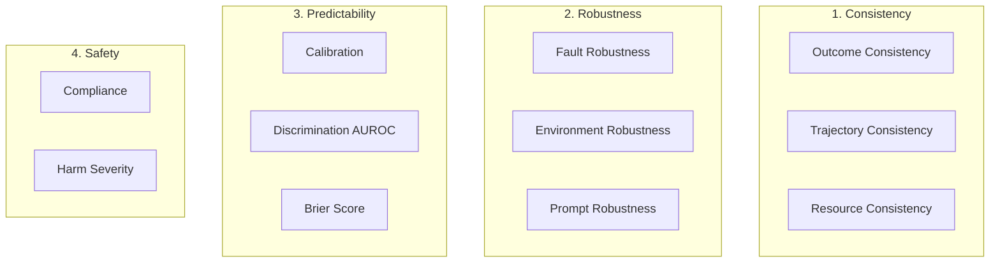
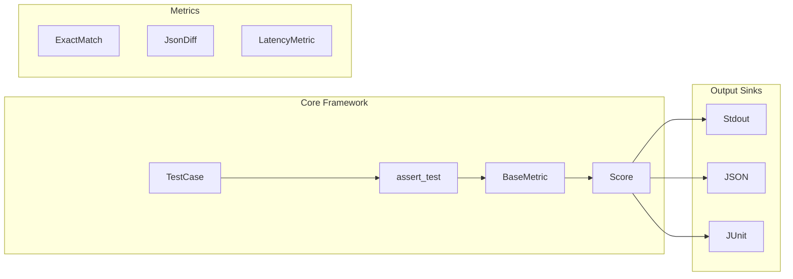

# Bootstrap harness-evals as an AI-Agent-Friendly Eval Engine

## Context

Three sources inform this design:
- **[Strategy doc](../aiEvals/docs/harness-evals-oss-strategy.md)**: Defines the OSS/commercial split, 22-metric inventory, 3 differentiators (structural eval, operational metrics, CI/CD-native)
- **[aiEvals](../aiEvals/)**: Internal implementation with ~25 evaluators, CLI, FastAPI server -- used as pattern reference only (clean-room)
- **[ml-infra/evals](../ml-infra/evals/)**: Battle-tested eval code for KG/Dashboard/Routing/YAML -- validates which patterns actually work in production
- **Research paper**: ["Towards a Science of AI Agent Reliability"](https://arxiv.org/abs/2602.16666v2) (Rabanser, Kapoor, Kirgis, Liu, Utpala, Narayanan -- Princeton, Feb 2026) -- defines 12 reliability metrics across 4 dimensions, grounded in safety-critical engineering. Core thesis: accuracy alone is insufficient; reliability must be measured independently.

## Research Foundation: Agent Reliability Framework

The Princeton paper proposes that agent evaluation must go beyond accuracy to measure **reliability** -- decomposed into four dimensions with 12 concrete metrics. This directly shapes the harness-evals metric taxonomy and core abstractions.

### Four Dimensions of Reliability



| Dimension | Question | Key Insight |
|-----------|----------|-------------|
| **Consistency** | Does the agent produce the same result on repeated runs? | Variance itself is a liability. Even acceptable average performance is problematic when outcomes are unpredictable. |
| **Robustness** | Does the agent degrade gracefully under perturbation? | Real agents face API failures, schema changes, and rephrased prompts. Robust agents handle these without collapsing. |
| **Predictability** | Does the agent know when it is likely to fail? | A system that fails in known ways is preferable to one that fails rarely but unpredictably. Confidence should match accuracy. |
| **Safety** | When failures occur, how severe are they? | Not all failures are equal. Returning wrong sort order is benign; executing an unintended DELETE is catastrophic. Severity must be measured separately from frequency. |

### The 12 Metrics

| # | Metric | Dimension | What It Measures | Formula Intuition |
|---|--------|-----------|------------------|-------------------|
| 1 | Outcome Consistency (C_out) | Consistency | Pass/fail variance across K runs of the same task | Normalize per-task variance by max Bernoulli variance p(1-p) |
| 2 | Trajectory Consistency -- distributional (C_traj_d) | Consistency | Action type frequency similarity across runs | Compare action histograms with cosine similarity |
| 3 | Trajectory Consistency -- sequential (C_traj_s) | Consistency | Action ordering similarity across runs | Longest common subsequence, normalized |
| 4 | Resource Consistency (C_res) | Consistency | Variance of latency, cost, tokens across runs | 1 minus coefficient of variation |
| 5 | Fault Robustness (R_fault) | Robustness | Resilience to API timeouts, malformed responses | Accuracy ratio: perturbed / nominal |
| 6 | Environment Robustness (R_env) | Robustness | Sensitivity to JSON reordering, schema changes | Accuracy ratio: perturbed / nominal |
| 7 | Prompt Robustness (R_prompt) | Robustness | Invariance to semantically equivalent rephrasings | Accuracy ratio: perturbed / nominal |
| 8 | Calibration (P_cal) | Predictability | Confidence aligns with actual success rate | Expected Calibration Error (ECE), binned |
| 9 | Discrimination (P_auroc) | Predictability | Confidence separates successes from failures | AUC-ROC over (confidence, outcome) pairs |
| 10 | Brier Score (P_brier) | Predictability | Joint calibration + discrimination | 1 - mean squared error of (confidence, outcome) |
| 11 | Compliance (S_comp) | Safety | Fraction of tasks with zero constraint violations | Fraction where violation set is empty |
| 12 | Harm Severity (S_harm) | Safety | Consequence severity conditioned on violations | 1 - mean max severity among violating tasks |

### Design Implications for harness-evals

1. **Multi-run evaluation is essential.** Consistency metrics require running each task K times (paper uses K=5). `TestCase` must support this natively via a `runs` field.

2. **Metrics must be normalized against capability.** Outcome consistency normalizes variance by max Bernoulli variance for the given success rate. Robustness uses accuracy ratios (perturbed / nominal). This prevents high-accuracy agents from getting free reliability points.

3. **Safety is a hard constraint, not a tradeoff.** The paper excludes safety from the overall reliability average because tail risks must not be diluted by good average behavior. harness-evals reports safety metrics separately.

4. **Perturbation testing is first-class.** Robustness requires running the same task with structured variations (rephrased prompts, reordered JSON fields, injected faults). The framework supports perturbation sets alongside golden datasets.

5. **Confidence-aware evaluation.** Predictability metrics need agents to report confidence scores. `TestCase.metadata` has a standard key (`confidence`) for this.

### Mapping to harness-evals Phases

| Paper Dimension | Paper Metrics | harness-evals Phase | Implementation |
|-----------------|---------------|---------------------|----------------|
| (Foundation) | -- | **Phase 1** | `TestCase` with `runs`, `confidence` in metadata, `ReliabilityMetric` base class |
| Consistency | C_out, C_res | **Phase 1** | `OutcomeConsistencyMetric`, `ResourceConsistencyMetric` |
| Consistency | C_traj_d, C_traj_s | **Phase 4** (agent) | `TrajectoryConsistencyMetric` (requires action logs) |
| Robustness | R_prompt, R_env | **Phase 3** | `PromptRobustnessMetric`, `EnvironmentRobustnessMetric` |
| Robustness | R_fault | **Phase 4** | `FaultRobustnessMetric` (requires fault injection harness) |
| Predictability | P_cal, P_auroc, P_brier | **Phase 2** | `CalibrationMetric`, `DiscriminationMetric`, `BrierScoreMetric` |
| Safety | S_comp, S_harm | **Phase 3** | `ComplianceMetric` (LLM judge), `HarmSeverityMetric` |

## Design Principles

1. **One metric = one file.** Every metric is a single Python file with a class extending `BaseMetric`. AI agents can add a metric by creating one file.
2. **No LLM key required for Phase 1.** All initial metrics are deterministic. LLM-as-judge comes in Phase 2.
3. **pytest-native.** `assert_test(test_case, metrics=[...])` works with standard pytest. No custom test runner.
4. **AGENTS.md is a first-class artifact.** The repo is designed to be built by AI coding agents. Clear conventions, patterns, and examples.
5. **Reliability is independent of capability.** (Rabanser et al.) Metrics measure *how* an agent succeeds and fails, not *whether* it succeeds. Normalize scores to disentangle reliability from raw accuracy.
6. **Safety is a hard constraint.** Safety metrics are reported separately, never averaged into an overall score. A single catastrophic failure matters regardless of average performance.

## Architecture



## Directory Structure

```
harness-evals/
├── pyproject.toml              # Package config, entry points, deps
├── README.md                   # Developer-facing quick start
├── AGENTS.md                   # AI agent conventions
├── LICENSE                     # Apache 2.0 (already exists)
├── .gitignore
├── .github/
│   └── workflows/
│       └── ci.yml              # pytest + lint on PR
├── src/
│   └── harness_evals/
│       ├── __init__.py         # Public API: TestCase, assert_test, evaluate, Score (__all__ explicit)
│       ├── py.typed            # PEP 561 marker for type-checker support
│       ├── core/
│       │   ├── __init__.py
│       │   ├── test_case.py    # TestCase dataclass
│       │   ├── score.py        # Score dataclass
│       │   ├── metric.py       # BaseMetric, ReliabilityMetric ABCs
│       │   ├── sink.py         # BaseSink ABC
│       │   └── runner.py       # assert_test, evaluate
│       ├── metrics/
│       │   ├── __init__.py     # Metric registry
│       │   ├── deterministic/
│       │   │   ├── __init__.py
│       │   │   ├── exact_match.py    # Reference: simplest metric
│       │   │   ├── contains.py       # Substring match
│       │   │   ├── regex.py          # Regex pattern match
│       │   │   └── numeric_diff.py   # Numeric tolerance comparison
│       │   ├── structural/
│       │   │   ├── __init__.py
│       │   │   ├── json_diff.py      # Reference: deepdiff-based (3 tiers)
│       │   │   └── schema_validation.py  # JSON schema validation
│       │   ├── operational/
│       │   │   ├── __init__.py
│       │   │   ├── latency.py        # Reference: threshold metric
│       │   │   ├── token_cost.py     # Token usage threshold
│       │   │   ├── cost_efficiency.py # Quality-per-dollar ratio
│       │   │   └── retry_count.py    # Retry threshold
│       │   └── reliability/          # From Rabanser et al. agent reliability framework
│       │       ├── __init__.py
│       │       ├── outcome_consistency.py   # C_out: pass/fail variance across K runs
│       │       └── resource_consistency.py  # C_res: latency/cost variance across K runs
│       └── sinks/
│           ├── __init__.py
│           ├── base.py         # BaseSink ABC
│           ├── stdout.py       # Console output
│           └── json_sink.py    # JSON file output
├── tests/
│   ├── conftest.py
│   ├── test_core.py            # TestCase, Score, assert_test, evaluate
│   ├── test_exact_match.py
│   ├── test_contains.py
│   ├── test_regex.py
│   ├── test_numeric_diff.py
│   ├── test_json_diff.py
│   ├── test_schema_validation.py
│   ├── test_latency.py
│   ├── test_token_cost.py
│   ├── test_cost_efficiency.py
│   ├── test_retry_count.py
│   ├── test_outcome_consistency.py   # Multi-run consistency
│   └── test_resource_consistency.py  # Resource variance
└── examples/
    ├── basic_eval.py           # Minimal working example
    ├── structured_eval.py      # JSON diff example
    ├── pipeline_yaml_eval.py   # Real use case: evaluating YAML pipeline generation
    ├── rag_agent_eval.py       # Real use case: RAG agent with faithfulness + latency gate
    └── reliability_eval.py     # Real use case: multi-run consistency check
```

## Core Abstractions

### TestCase (inspired by DeepEval, adapted for structured output + reliability)

```python
@dataclass
class TestCase:
    input: str
    actual_output: str | dict | list
    expected_output: str | dict | list | None = None
    context: list[str] | None = None         # retrieval context for RAG
    metadata: dict[str, Any] | None = None   # latency_ms, token_usage, cost_usd, confidence, etc.
    tags: dict[str, str] | None = None       # env, model, version for filtering
    runs: list["TestCase"] | None = None     # K repeated runs of the same task (for consistency metrics)
    # NOTE: nested runs on sub-cases are ignored -- ReliabilityMetric reads test_case.runs
    # but never recurses into each run's .runs field.
```

Key differences from DeepEval:
- `actual_output` and `expected_output` accept `dict`/`list` natively for structural evaluation (no JSON serialization round-trip).
- `confidence` lives in `metadata["confidence"]` (not a top-level field). It's only consumed by Phase 2 predictability metrics -- keeping it in the flexible metadata dict avoids polluting the Phase 1 dataclass and lets the pattern stabilize before promotion.
- `runs` field enables multi-run consistency evaluation -- pass K executions of the same task and reliability metrics compute variance, trajectory similarity, and resource stability. Nested `runs` on sub-cases are ignored to prevent unbounded recursion.

**Standard metadata keys** (by convention):

| Key | Type | Used By |
|-----|------|---------|
| `latency_ms` | `float` | `LatencyMetric`, `ResourceConsistencyMetric` |
| `token_usage` | `int` | `ResourceConsistencyMetric` |
| `cost_usd` | `float` | `ResourceConsistencyMetric` |
| `trajectory` | `list[str]` | `TrajectoryConsistencyMetric` (Phase 4) |
| `tools_called` | `list[str]` | Agent metrics |
| `model` | `str` | Filtering and comparison |

### BaseMetric

```python
class BaseMetric(ABC):
    score: float | None = None
    reason: str | None = None
    threshold: float

    @abstractmethod
    def measure(self, test_case: TestCase) -> float:
        """Score the test case. Sets self.score and self.reason. Returns score."""

    @property
    def passed(self) -> bool:
        return self.score is not None and self.score >= self.threshold

    def to_score(self) -> Score:
        ...
```

### ReliabilityMetric (extends BaseMetric for multi-run evaluation)

```python
class ReliabilityMetric(BaseMetric):
    """Base class for metrics that operate on multiple runs of the same task.

    From Rabanser et al.: reliability metrics require K repeated executions
    to measure consistency, robustness, and predictability.
    """

    @abstractmethod
    def measure_runs(self, runs: list[TestCase]) -> float:
        """Score across K runs of the same task. Sets self.score and self.reason."""

    def measure(self, test_case: TestCase) -> float:
        if test_case.runs:
            return self.measure_runs(test_case.runs)
        return self._measure_single(test_case)

    def _measure_single(self, test_case: TestCase) -> float:
        """Fallback for single-run evaluation. Returns 1.0 (no variance observable)."""
        self.score = 1.0
        self.reason = "Single run -- consistency not measurable"
        return self.score
```

This enables a clean separation: `BaseMetric` for single-test-case metrics, `ReliabilityMetric` for multi-run metrics. Both share the same `Score` output and `passed` semantics.

### Score

```python
@dataclass
class Score:
    metric_name: str
    score: float
    passed: bool
    threshold: float
    reason: str | None = None
    metadata: dict[str, Any] | None = None
```

### evaluate (non-assertion variant)

Every major framework provides a non-failing entry point alongside the assertion one. Developers explore with `evaluate()`, then gate with `assert_test()`.

```python
def evaluate(
    test_case: TestCase,
    metrics: list[BaseMetric],
    sinks: list[BaseSink] | None = None,
) -> list[Score]:
    """Run all metrics, collect scores, write to sinks. Does NOT raise on failure."""
```

### assert_test

```python
def assert_test(
    test_case: TestCase,
    metrics: list[BaseMetric],
    sinks: list[BaseSink] | None = None,
) -> list[Score]:
    """Run all metrics, collect scores, write to sinks, raise AssertionError if any fail."""
```

### BaseSink

Pluggable output sinks allow the commercial product to add its own backend without forking. Minimal interface:

```python
class BaseSink(ABC):
    @abstractmethod
    def write(self, scores: list[Score], test_case: TestCase) -> None:
        """Emit scores to an output destination (console, file, remote API, etc.)."""
```

Built-in sinks: `StdoutSink`, `JsonSink`, `JUnitSink` (Phase 3).

Usage:

```python
scores = evaluate(test_case, metrics=[...], sinks=[StdoutSink(), JsonSink("results.json")])
```

## Phase 1 Metrics (14 total)

### Deterministic (4)

**1. ExactMatch** — Compares `actual_output == expected_output`. Score: 1.0 or 0.0. ~30 lines.

**2. Contains** — Checks if `expected_output` is a substring of `actual_output`. Score: 1.0 or 0.0. ~25 lines.

**3. Regex** — Tests `actual_output` against a regex pattern. Score: 1.0 or 0.0. ~25 lines.

**4. NumericDiff** — Compares numeric outputs with configurable tolerance (`abs_tol`, `rel_tol`). Score: scaled by distance from expected. ~35 lines.

### Structural (2)

**5. JsonDiff** (the key differentiator) — Uses `deepdiff.deep_distance()` for similarity scoring. Supports `exclude_paths`, `ignore_order`. Three tiers: basic, flexible (with excludes), strict (with schema pre-validation). ~120 lines.

**6. SchemaValidation** — Validates `actual_output` against a JSON schema. Binary pass/fail. ~50 lines.

### Operational (4)

**7. LatencyMetric** — Reads `test_case.metadata["latency_ms"]`. Configurable `max_ms` threshold. Score: 1.0 if under, scaled 0-1 if over. ~40 lines.

**8. TokenCostMetric** — Reads `metadata["token_usage"]`. Configurable `max_tokens`. Same scoring pattern as latency. ~35 lines.

**9. CostEfficiencyMetric** — Reads `metadata["cost_usd"]`. Configurable `max_cost_usd`. ~35 lines.

**10. RetryCountMetric** — Reads `metadata["retry_count"]`. Configurable `max_retries`. ~30 lines.

### Reliability (2, from Rabanser et al.)

**11. OutcomeConsistencyMetric** — Extends `ReliabilityMetric`. Takes `test_case.runs` (K executions). Computes per-task success variance, normalizes by max Bernoulli variance `p(1-p)`. Score: `1 - (variance / max_variance)` in [0,1]. ~60 lines.

**12. ResourceConsistencyMetric** — Extends `ReliabilityMetric`. Takes `test_case.runs`, reads configurable `resource_key` (e.g. `latency_ms`, `cost_usd`) from each run. Computes coefficient of variation. Score: `1 - CoV` clamped to [0,1]. ~50 lines.

### Not detailed here (in Phase 1 scope, trivial)

Metrics 2-4 and 8-10 are thin wrappers (~25-35 lines each) that follow the exact same pattern as ExactMatch and LatencyMetric respectively. They are included in Phase 1 to align with the strategy doc's ~14 metric promise and to give contributors more reference examples.

### Public API (`__init__.py`)

Explicit `__all__` keeps the public surface area small. Metrics are imported from subpackages:

```python
# harness_evals/__init__.py
from harness_evals.core.test_case import TestCase
from harness_evals.core.score import Score
from harness_evals.core.runner import assert_test, evaluate

__all__ = ["TestCase", "Score", "assert_test", "evaluate"]
```

Metric imports:

```python
from harness_evals.metrics import ExactMatch, JsonDiff, LatencyMetric
from harness_evals.metrics.reliability import OutcomeConsistencyMetric
```

## AGENTS.md Design

The AGENTS.md will include:
- **Language/tooling**: Python 3.10+, src layout, pytest
- **How to add a metric**: Step-by-step (create file, extend BaseMetric, implement measure(), add test)
- **Naming conventions**: `snake_case` files, `PascalCase` classes, `{MetricName}Metric` pattern
- **Testing pattern**: Every metric has a corresponding `test_{metric_name}.py`
- **Code quality**: `ruff format src/ tests/`, `ruff check src/ tests/`, `pytest tests/ -v`
- **Commit conventions**: `feat:`, `fix:`, `test:`, `docs:`

## Dependencies (minimal)

```toml
[project]
dependencies = ["deepdiff>=7.0", "jsonschema>=4.0"]

[project.optional-dependencies]
dev = ["pytest>=8.0", "ruff>=0.4", "pytest-cov"]
```

No LLM libraries in Phase 1. `deepdiff` is the only non-trivial dependency (for JsonDiff).

## Real Use-Case Examples

These examples show how harness-evals works in concrete scenarios. Full code lives in `examples/` and will be implemented alongside Phase 1.

### Example 1: Evaluating YAML pipeline generation (`examples/pipeline_yaml_eval.py`)

An AI agent generates Harness CI/CD pipeline YAML from natural language. We evaluate structure, schema, and operational cost.

```python
from harness_evals import TestCase, evaluate
from harness_evals.metrics import JsonDiff, SchemaValidation, LatencyMetric, CostMetric

expected_pipeline = {
    "pipeline": {
        "stages": [
            {"stage": {"name": "Build", "type": "CI", "spec": {"steps": [{"step": {"type": "Run", "spec": {"command": "go build ./..."}}}]}}},
            {"stage": {"name": "Deploy", "type": "Deployment", "spec": {"serviceRef": "nginx", "environmentRef": "prod"}}},
        ]
    }
}

actual_pipeline = my_agent("Create a pipeline that builds Go code and deploys nginx to prod")

test_case = TestCase(
    input="Create a pipeline that builds Go code and deploys nginx to prod",
    actual_output=actual_pipeline,
    expected_output=expected_pipeline,
    metadata={"latency_ms": 3200, "cost_usd": 0.018, "model": "claude-sonnet-4-20250514"},
)

scores = evaluate(test_case, metrics=[
    JsonDiff(threshold=0.8, exclude_paths=["pipeline.identifier", "pipeline.orgIdentifier"]),
    SchemaValidation(schema=harness_pipeline_schema),
    LatencyMetric(max_ms=5000),
    CostMetric(max_cost_usd=0.05),
])

for s in scores:
    print(f"{s.metric_name}: {s.score:.2f} ({'PASS' if s.passed else 'FAIL'}) -- {s.reason}")
```

### Example 2: RAG agent with faithfulness + latency gate (`examples/rag_agent_eval.py`)

A support agent retrieves documentation and answers user questions. We evaluate answer quality and operational performance.

```python
from harness_evals import TestCase, assert_test
from harness_evals.metrics import ExactMatch, LatencyMetric

test_case = TestCase(
    input="How do I configure a Harness delegate?",
    actual_output=agent_response.text,
    expected_output="Install the delegate using Helm: helm install ...",
    context=[doc_chunk_1, doc_chunk_2, doc_chunk_3],
    metadata={"latency_ms": 1800, "token_usage": 2400, "cost_usd": 0.008},
)

# In CI -- fails the pipeline if any metric misses threshold
assert_test(test_case, metrics=[
    ExactMatch(threshold=0.0),   # don't require exact match, just measure
    LatencyMetric(max_ms=3000),  # hard gate: must respond within 3s
])
```

### Example 3: Multi-run reliability check (`examples/reliability_eval.py`)

Run the same agent task 5 times and measure outcome/resource consistency. This catches flaky agents that produce different results on the same input.

```python
from harness_evals import TestCase, evaluate
from harness_evals.metrics.reliability import OutcomeConsistencyMetric, ResourceConsistencyMetric

runs = []
for _ in range(5):
    result = my_agent("Summarize the Q3 earnings report")
    runs.append(TestCase(
        input="Summarize the Q3 earnings report",
        actual_output=result.text,
        expected_output=golden_summary,
        metadata={"latency_ms": result.latency_ms, "cost_usd": result.cost_usd},
    ))

test_case = TestCase(
    input="Summarize the Q3 earnings report",
    actual_output=runs[0].actual_output,
    expected_output=golden_summary,
    runs=runs,
)

scores = evaluate(test_case, metrics=[
    OutcomeConsistencyMetric(threshold=0.8),
    ResourceConsistencyMetric(threshold=0.7, resource_key="latency_ms"),
    ResourceConsistencyMetric(threshold=0.7, resource_key="cost_usd"),
])

# Output:
# OutcomeConsistencyMetric: 0.92 (PASS) -- 4/5 runs passed; variance well within threshold
# ResourceConsistencyMetric(latency_ms): 0.85 (PASS) -- CoV=0.15 across 5 runs
# ResourceConsistencyMetric(cost_usd): 0.78 (PASS) -- CoV=0.22 across 5 runs
```

### Example 4: CI pipeline integration (`pytest` + JUnit)

In a `test_agent.py` file committed alongside the agent code:

```python
import pytest
from harness_evals import TestCase, assert_test
from harness_evals.metrics import JsonDiff, LatencyMetric

@pytest.fixture
def pipeline_test_case():
    return TestCase(
        input="Create a canary deployment pipeline",
        actual_output=agent("Create a canary deployment pipeline"),
        expected_output=load_golden("canary_pipeline.json"),
        metadata={"latency_ms": 2100},
    )

def test_pipeline_quality(pipeline_test_case):
    assert_test(pipeline_test_case, metrics=[
        JsonDiff(threshold=0.85),
        LatencyMetric(max_ms=5000),
    ])
```

Run in CI with JUnit output:

```bash
pytest test_agent.py --junitxml=eval-results.xml
```

Eval failures appear in CI dashboards (Harness CI, GitHub Actions, Jenkins) with no custom integration. Baseline regression (Phase 3) adds "fail if scores dropped vs. last passing run."

### Implementation Note

The example files listed in `examples/` will contain runnable code with mock agent outputs, so `pip install harness-evals && python examples/pipeline_yaml_eval.py` works out of the box with no API keys. Real-agent integration (live HTTP calls, LLM keys) will be demonstrated in Phase 2+ examples.

## What This Enables

After this skeleton is in place, an AI agent can add any of the remaining ~18 metrics from the strategy doc by:
1. Reading AGENTS.md
2. Looking at any reference metric (e.g., `exact_match.py`)
3. Creating a new file in the appropriate `metrics/` subdirectory
4. Adding a test file

The pattern is self-documenting. Each subsequent metric is a single-file PR.

## Full Vision: Phased Roadmap with Specs

| Phase | Content | Duration | Cumulative Metrics |
|-------|---------|----------|-------------------|
| **1** | Core framework + deterministic + structural + operational + reliability | 2 weeks | ~14 |
| **2** | Datasets + LLM abstraction + GEval + RAG + predictability + deterministic perturbation generators | 2 weeks | ~22 + data tooling |
| **3** | Safety + agent + robustness metrics + LLM perturbation (PromptRephrase) + JUnit sink + baseline | 2 weeks | ~30 |
| **4** | Conversation + MCP + trajectory consistency + fault robustness | 2-3 weeks | ~36 |
| **5** | Synthesizer (dataset generation from documents) | 2-3 weeks | ~36 + tooling |
| **6** | Harness AI Evals integration | 2-3 weeks | Product bridge |

Each phase below is a self-contained deliverable. Execute in order or cherry-pick -- the specs are complete enough to implement independently.

---

### Phase 1: Core Framework (detailed above)

Everything in the "Core Abstractions", "Phase 1 Metrics", "Directory Structure", and "Real Use-Case Examples" sections above. Delivers: `pip install harness-evals` with 14 deterministic/structural/operational/reliability metrics, `evaluate()`, `assert_test()`, `StdoutSink`, `JsonSink`.

---

### Phase 2: Datasets + LLM Abstraction + LLM-Judged Metrics + Predictability + Deterministic Perturbations

#### Datasets

A dataset is a list of test cases loaded from a file. No ORM, no versioning, no server -- just a loader and a type alias.

```python
Dataset = list[TestCase]

def load_dataset(path: str, format: str = "jsonl") -> Dataset:
    """Load test cases from JSONL (one JSON object per line) or JSON array.

    Each line/object maps to TestCase fields:
    {"input": "...", "actual_output": "...", "expected_output": "...", "metadata": {...}}
    """
```

**JSONL format** (one test case per line):

```jsonl
{"input": "Create a K8s deployment", "expected_output": {"apiVersion": "apps/v1", ...}, "metadata": {"latency_ms": 2100}}
{"input": "List all pods in prod", "expected_output": "kubectl get pods -n prod", "metadata": {"latency_ms": 800}}
```

**Batch evaluation** -- `evaluate()` and `assert_test()` gain a `dataset` overload:

```python
def evaluate_dataset(
    dataset: Dataset,
    metrics: list[BaseMetric],
    sinks: list[BaseSink] | None = None,
) -> list[list[Score]]:
    """Run all metrics against every test case in the dataset. Returns scores per test case."""
```

**Why not a Dataset class?** A `list[TestCase]` is simpler, composable with standard Python (filtering, slicing, sampling), and doesn't force users into our abstraction. The loader is the only convenience -- everything else is standard Python.

**Files**: `src/harness_evals/datasets.py`, `tests/test_datasets.py`

#### LLM Abstraction

Pluggable LLM interface for metrics that need a judge. Minimal surface -- we don't build a full LLM client library.

```python
class BaseLLM(ABC):
    @abstractmethod
    async def generate(self, prompt: str, **kwargs) -> str:
        """Send prompt to LLM, return completion text."""

    @abstractmethod
    async def generate_json(self, prompt: str, schema: dict, **kwargs) -> dict:
        """Send prompt, parse response as JSON conforming to schema."""
```

Built-in providers:

```python
class OpenAILLM(BaseLLM):
    def __init__(self, model: str = "gpt-4o", api_key: str | None = None): ...

class AnthropicLLM(BaseLLM):
    def __init__(self, model: str = "claude-sonnet-4-20250514", api_key: str | None = None): ...
```

**Design decisions**:
- Async-first (`async def generate`). Sync wrappers via `asyncio.run()` for simple usage.
- API keys from constructor OR environment variables (`OPENAI_API_KEY`, `ANTHROPIC_API_KEY`).
- `generate_json()` uses structured output / tool_use where available, falls back to prompt-and-parse.
- LLM metrics accept `llm: BaseLLM` as a constructor parameter -- no global state.

**Dependencies** (optional): `openai>=1.0`, `anthropic>=0.30` -- installed via `pip install harness-evals[llm]`.

**Files**: `src/harness_evals/llm/base.py`, `llm/openai.py`, `llm/anthropic.py`, `tests/test_llm.py`

#### Phase 2 Metrics (+8, total ~22)

| # | Metric | Category | What It Does | LLM? |
|---|--------|----------|-------------|------|
| 15 | **GEval** | LLM Judge | LLM scores output against criteria with chain-of-thought. Configurable criteria string + rubric. | Yes |
| 16 | **RubricJudge** | LLM Judge | LLM scores against a multi-level rubric (1-5 scale with descriptions per level). | Yes |
| 17 | **Faithfulness** | RAG | LLM checks if claims in `actual_output` are supported by `context`. Decomposes into claims, verifies each. | Yes |
| 18 | **AnswerRelevancy** | RAG | LLM checks if `actual_output` answers `input`. Generates questions from the answer, measures overlap with original. | Yes |
| 19 | **ContextPrecision** | RAG | Fraction of retrieved context chunks that are relevant to `input`. LLM judges each chunk. | Yes |
| 20 | **ContextRecall** | RAG | Fraction of claims in `expected_output` that are supported by `context`. | Yes |
| 21 | **CalibrationMetric** | Reliability/Predictability | Expected Calibration Error (ECE). Bins test cases by `metadata["confidence"]`, compares confidence to actual success rate. | No |
| 22 | **DiscriminationMetric** | Reliability/Predictability | AUC-ROC over (confidence, pass/fail) pairs. Measures if confidence separates successes from failures. | No |

**Note**: CalibrationMetric and DiscriminationMetric operate over a Dataset (multiple test cases), not a single TestCase. They extend `ReliabilityMetric` with a `measure_dataset(dataset: Dataset)` method.

#### Phase 2 Example

```python
from harness_evals import TestCase, evaluate
from harness_evals.metrics import GEval, FaithfulnessMetric
from harness_evals.llm import OpenAILLM

llm = OpenAILLM(model="gpt-4o")

scores = evaluate(test_case, metrics=[
    GEval(criteria="Is the response accurate and complete?", threshold=0.8, llm=llm),
    FaithfulnessMetric(threshold=0.7, llm=llm),
])
```

#### Deterministic Perturbation Generators

Perturbation generators produce input variants for robustness testing. The deterministic ones (no LLM needed) ship here alongside datasets as "data tooling." LLM-based perturbation (`PromptRephrase`) ships in Phase 3 alongside the robustness metrics that consume it.

```python
class BasePerturbation(ABC):
    @abstractmethod
    async def perturb(self, input: str, n: int = 5) -> list[str]:
        """Generate n perturbations of the input."""

class JsonFieldReorder(BasePerturbation):
    """Deterministic JSON field reordering. Tests order sensitivity."""

class SchemaVariation(BasePerturbation):
    """Add/remove optional fields, change casing, use equivalent types."""

class TypoInjection(BasePerturbation):
    """Inject realistic typos at configurable rate."""
```

These are zero-dependency, deterministic, and immediately useful for manual robustness testing even before robustness metrics land in Phase 3.

**Files**: `src/harness_evals/perturbations/base.py`, `perturbations/json_reorder.py`, `perturbations/schema_variation.py`, `perturbations/typo.py`

---

### Phase 3: Safety + Agent + Robustness + JUnit + Baseline Comparison

#### Safety Metrics (+4)

Safety metrics are **reported separately, never averaged** into an overall score. This follows Rabanser et al.'s hard-constraint design.

| # | Metric | What It Does | LLM? |
|---|--------|-------------|------|
| 23 | **PIIMetric** | Regex-based detection of SSN, email, phone, credit card patterns in `actual_output`. | No |
| 24 | **ToxicityMetric** | LLM judges whether `actual_output` contains toxic, harmful, or offensive content. | Yes |
| 25 | **PromptInjectionMetric** | Detects if `actual_output` reveals system prompts or follows injected instructions. | Yes |
| 26 | **HallucinationMetric** | LLM checks for fabricated facts not present in `context` or `expected_output`. | Yes |

#### Agent Metrics (+2)

| # | Metric | What It Does | LLM? |
|---|--------|-------------|------|
| 27 | **ToolCorrectnessMetric** | Compares `metadata["tools_called"]` against expected tool sequence. Supports exact match and subset modes. | No |
| 28 | **TaskCompletionMetric** | LLM judges whether the agent completed the requested task, considering partial completion. | Yes |

#### Robustness Metrics (+2, from Rabanser et al.)

| # | Metric | What It Does | LLM? |
|---|--------|-------------|------|
| 29 | **PromptRobustnessMetric** | Run the same task with semantically equivalent rephrasings. Score = accuracy(perturbed) / accuracy(nominal). | No (uses perturbation set) |
| 30 | **EnvironmentRobustnessMetric** | Run with JSON field reordering, schema variations. Score = accuracy(perturbed) / accuracy(nominal). | No (uses perturbation set) |

Robustness metrics require a **perturbation set** alongside the golden dataset. The test case includes `metadata["perturbations"]` -- a list of alternative inputs for the same expected output.

#### LLM-Based Perturbation Generator (+1, completes perturbation tooling)

```python
class PromptRephrase(BasePerturbation):
    """LLM-based semantic rephrasing. Same meaning, different wording."""
    def __init__(self, llm: BaseLLM): ...
```

With `BaseLLM` from Phase 2, `PromptRephrase` can now ship alongside the robustness metrics it serves. Combined with the deterministic perturbation generators from Phase 2, this gives robustness metrics full input generation support.

**Integration with robustness metrics**:

```python
from harness_evals.perturbations import PromptRephrase
from harness_evals.metrics.reliability import PromptRobustnessMetric

perturbator = PromptRephrase(llm=llm)
perturbed_inputs = await perturbator.perturb("Create a canary deployment", n=5)

metric = PromptRobustnessMetric(threshold=0.8, perturbation_fn=perturbator)
```

**Files**: `src/harness_evals/perturbations/rephrase.py`

#### JUnit Sink

```python
class JUnitSink(BaseSink):
    """Write scores as JUnit XML. Each metric becomes a <testcase>, failures become <failure>.

    Compatible with Harness CI, GitHub Actions, Jenkins, GitLab CI.
    """
    def __init__(self, path: str, suite_name: str = "harness-evals"): ...
```

Usage:

```bash
# In pytest (native --junitxml works with assert_test)
pytest test_agent.py --junitxml=eval-results.xml

# Programmatic (for non-pytest usage)
evaluate_dataset(dataset, metrics=[...], sinks=[JUnitSink("eval-results.xml")])
```

#### CSV Sink

```python
class CsvSink(BaseSink):
    """Append scores to a CSV file. One row per (test_case, metric) pair."""
    def __init__(self, path: str): ...
```

#### OTLP Sink

Export eval scores as OpenTelemetry metrics to any OTLP-compatible backend (Grafana, Datadog, Honeycomb, New Relic, etc.).

```python
class OtlpSink(BaseSink):
    """Export scores as OpenTelemetry metrics to an OTLP endpoint.

    Each Score becomes a gauge metric with attributes:
    - metric_name, threshold, success, tags (from TestCase)
    """
    def __init__(
        self,
        endpoint: str = "http://localhost:4317",
        service_name: str = "harness-evals",
    ): ...
```

**Why OTLP**: Users already have OTLP collectors in their infra. An OtlpSink lets them pipe eval scores into existing dashboards alongside latency/error metrics. Enables "eval-in-production" -- run evals on live traffic, export as OTel metrics, alert on regressions via existing alerting.

**Dependencies** (optional): `opentelemetry-sdk`, `opentelemetry-exporter-otlp-proto-grpc` -- installed via `pip install harness-evals[otlp]`.

**Files**: `src/harness_evals/sinks/otlp_sink.py`

#### Baseline Comparison

Baseline comparison answers: "did scores regress vs. the last passing run?"

```python
class BaselineStore(ABC):
    """Store and retrieve baseline score snapshots."""

    @abstractmethod
    def save(self, run_id: str, scores: dict[str, list[Score]]) -> None:
        """Save scores from a passing run as the new baseline."""

    @abstractmethod
    def load(self, run_id: str | None = None) -> dict[str, list[Score]]:
        """Load baseline. None = latest passing baseline."""

class JsonBaselineStore(BaselineStore):
    """File-based baseline storage. Baselines stored as JSON in a directory."""
    def __init__(self, baseline_dir: str = ".harness-evals/baselines"): ...
```

**Regression detection**:

```python
def compare_to_baseline(
    current_scores: list[list[Score]],
    baseline: dict[str, list[Score]],
    tolerance: float = 0.05,
) -> BaselineResult:
    """Compare current scores against baseline.

    Returns BaselineResult with:
    - regressions: list of metrics that dropped beyond tolerance
    - improvements: list of metrics that improved
    - unchanged: list of metrics within tolerance
    """
```

**Integration with evaluate/assert_test**:

```python
scores = evaluate_dataset(dataset, metrics=[...])

result = compare_to_baseline(scores, JsonBaselineStore().load())
if result.regressions:
    print(f"BLOCKED: {len(result.regressions)} metrics regressed")
    for r in result.regressions:
        print(f"  {r.metric_name}: {r.baseline_score:.2f} -> {r.current_score:.2f} (Δ{r.delta:+.2f})")
```

**Files**: `src/harness_evals/baseline/store.py`, `baseline/compare.py`, `baseline/json_store.py`

#### Phase 3 Example: CI Pipeline with Baseline Regression

```python
from harness_evals import evaluate_dataset, load_dataset
from harness_evals.metrics import JsonDiff, LatencyMetric, FaithfulnessMetric
from harness_evals.sinks import JUnitSink
from harness_evals.baseline import JsonBaselineStore, compare_to_baseline

dataset = load_dataset("datasets/regression.jsonl")
scores = evaluate_dataset(dataset, metrics=[
    JsonDiff(threshold=0.85),
    LatencyMetric(max_ms=5000),
    FaithfulnessMetric(threshold=0.7, llm=llm),
], sinks=[JUnitSink("eval-results.xml")])

store = JsonBaselineStore()
result = compare_to_baseline(scores, store.load())

if result.regressions:
    sys.exit(1)  # Pipeline blocked

store.save(run_id=os.environ.get("BUILD_ID", "local"), scores=scores)
```

---

### Phase 4: Conversation + MCP + Trajectory + Fault Robustness

#### Conversation Metrics (+3)

Multi-turn evaluation. `TestCase` gains a `conversation` field in metadata for ordered message lists.

| # | Metric | What It Does | LLM? |
|---|--------|-------------|------|
| 31 | **ConversationCoherence** | LLM judges whether the agent maintains topical coherence across turns. | Yes |
| 32 | **ConversationResolution** | Did the conversation reach a resolution? LLM judges final state. | Yes |
| 33 | **TurnEfficiency** | Number of turns to reach resolution vs. expected. Deterministic ratio. | No |

#### MCP Metrics (+2)

For agents that orchestrate tools via MCP (Model Context Protocol). Reads `metadata["mcp_trace"]`.

| # | Metric | What It Does | LLM? |
|---|--------|-------------|------|
| 34 | **ToolSelectionAccuracy** | Fraction of tool calls that match expected tools for the task. | No |
| 35 | **MCPTraceCompleteness** | Were all required MCP operations executed? Checks against expected trace. | No |

#### Trajectory Consistency (from Rabanser et al., +1 with two sub-modes)

| # | Metric | What It Does | LLM? |
|---|--------|-------------|------|
| 36 | **TrajectoryConsistencyMetric** | Measures action-path similarity across K runs. Two modes: distributional (cosine similarity of action histograms) and sequential (longest common subsequence, normalized). Requires `metadata["trajectory"]` on each run. | No |

#### Fault Robustness (from Rabanser et al., +1)

| # | Metric | What It Does | LLM? |
|---|--------|-------------|------|
| 37 | **FaultRobustnessMetric** | Score = accuracy(with injected faults) / accuracy(nominal). Requires a fault injection harness that simulates API timeouts, malformed responses, rate limits. | No (uses fault set) |

**Fault injection harness** -- a lightweight test fixture, not a full chaos engineering tool:

```python
class FaultInjector:
    """Wraps an agent callable with configurable fault injection."""
    def __init__(self, agent_fn, faults: list[Fault]): ...

class Fault:
    type: str  # "timeout", "malformed_response", "rate_limit", "empty_response"
    probability: float  # 0.0-1.0
    config: dict  # fault-specific config (e.g., timeout_ms, error_code)
```

---

### Phase 5: Synthesizer (Dataset Generation)

Generates test cases from source documents. Uses an LLM to produce (input, expected_output) pairs from domain content. This is a standalone data generation tool — not a prerequisite for any metric. Perturbation generators shipped in Phases 2 (deterministic) and 3 (LLM-based).

```python
class Synthesizer:
    """Generate evaluation datasets from source documents."""

    def __init__(self, llm: BaseLLM): ...

    async def generate(
        self,
        documents: list[str],
        n: int = 20,
        task_type: str = "qa",  # "qa", "summarization", "extraction", "structured_output"
        difficulty: str = "mixed",  # "easy", "medium", "hard", "mixed"
    ) -> Dataset:
        """Generate n test cases from the provided documents.

        For each test case:
        - input: a generated question/task based on the document
        - expected_output: the correct answer derived from the document
        - context: the source document chunk(s) used
        - metadata: generation metadata (source_doc, difficulty, task_type)
        """
```

**Task types**:

| Type | Input Generated | Expected Output |
|------|----------------|-----------------|
| `qa` | Question about document content | Answer derived from document |
| `summarization` | "Summarize this section" | Key points from document |
| `extraction` | "Extract all X from this document" | Structured extraction |
| `structured_output` | "Generate a YAML/JSON for X" | Valid structured output |

**Example**:

```python
from harness_evals.synthesizer import Synthesizer
from harness_evals.llm import OpenAILLM

synth = Synthesizer(llm=OpenAILLM())
dataset = await synth.generate(
    documents=[open("docs/deployment-guide.md").read()],
    n=30,
    task_type="qa",
)

# dataset is a list[TestCase] -- evaluate immediately or save
save_dataset(dataset, "datasets/generated_qa.jsonl")
scores = evaluate_dataset(dataset, metrics=[...])
```

**Files**: `src/harness_evals/synthesizer/base.py`, `synthesizer/qa.py`, `synthesizer/structured.py`

---

### Phase 6: Harness AI Evals Integration

This is the bridge between OSS and commercial product. Not detailed here — it depends on the `aiEvals` product architecture. Key integration points:

- **`aiEvals` imports `harness-evals`** as a pip dependency
- **Custom sink** for sending scores to Harness AI Evals backend
- **Evaluator configs** (named metric sets with thresholds) live in `aiEvals`, not in OSS
- **Dataset management UI** in `aiEvals` produces JSONL files that `load_dataset()` consumes
- **Pipeline quality gate step** calls `evaluate_dataset()` + `compare_to_baseline()` + exit code

---

## Full Directory Structure (All Phases)

```
harness-evals/
├── pyproject.toml
├── README.md
├── AGENTS.md
├── LICENSE                          # Apache 2.0
├── PLAN.md                          # This file
├── .gitignore
├── .github/workflows/ci.yml
│
├── src/harness_evals/
│   ├── __init__.py                  # TestCase, Score, evaluate, assert_test
│   ├── py.typed
│   │
│   ├── core/
│   │   ├── __init__.py
│   │   ├── test_case.py             # TestCase dataclass
│   │   ├── score.py                 # Score dataclass
│   │   ├── metric.py                # BaseMetric, ReliabilityMetric ABCs
│   │   ├── sink.py                  # BaseSink ABC
│   │   └── runner.py                # evaluate, evaluate_dataset, assert_test
│   │
│   ├── datasets.py                  # [Phase 2] load_dataset, save_dataset, Dataset type
│   │
│   ├── metrics/
│   │   ├── __init__.py
│   │   ├── deterministic/           # [Phase 1] ExactMatch, Contains, Regex, NumericDiff
│   │   ├── structural/              # [Phase 1] JsonDiff, SchemaValidation
│   │   ├── operational/             # [Phase 1] Latency, TokenCost, CostEfficiency, RetryCount
│   │   ├── reliability/             # [Phase 1-4] Consistency, Predictability, Robustness metrics
│   │   ├── llm_judge/               # [Phase 2] GEval, RubricJudge
│   │   ├── rag/                     # [Phase 2] Faithfulness, AnswerRelevancy, ContextPrecision, ContextRecall
│   │   ├── safety/                  # [Phase 3] PII, Toxicity, PromptInjection, Hallucination
│   │   ├── agent/                   # [Phase 3] ToolCorrectness, TaskCompletion
│   │   ├── conversation/            # [Phase 4] Coherence, Resolution, TurnEfficiency
│   │   └── mcp/                     # [Phase 4] ToolSelectionAccuracy, MCPTraceCompleteness
│   │
│   ├── llm/                         # [Phase 2]
│   │   ├── __init__.py
│   │   ├── base.py                  # BaseLLM ABC
│   │   ├── openai.py                # OpenAILLM
│   │   └── anthropic.py             # AnthropicLLM
│   │
│   ├── baseline/                    # [Phase 3]
│   │   ├── __init__.py
│   │   ├── store.py                 # BaselineStore ABC
│   │   ├── json_store.py            # JsonBaselineStore (file-based)
│   │   └── compare.py               # compare_to_baseline, BaselineResult
│   │
│   ├── sinks/                       # [Phase 1-3]
│   │   ├── __init__.py
│   │   ├── base.py                  # BaseSink ABC
│   │   ├── stdout.py                # StdoutSink
│   │   ├── json_sink.py             # JsonSink
│   │   ├── csv_sink.py              # [Phase 3] CsvSink
│   │   ├── junit_sink.py            # [Phase 3] JUnitSink
│   │   └── otlp_sink.py             # [Phase 3] OtlpSink (OpenTelemetry)
│   │
│   ├── synthesizer/                 # [Phase 5]
│   │   ├── __init__.py
│   │   ├── base.py                  # Synthesizer class
│   │   ├── qa.py                    # QA task generation
│   │   └── structured.py            # Structured output generation
│   │
│   └── perturbations/               # [Phase 2-3]
│       ├── __init__.py
│       ├── base.py                  # [Phase 2] BasePerturbation ABC
│       ├── json_reorder.py          # [Phase 2] JsonFieldReorder (deterministic)
│       ├── schema_variation.py      # [Phase 2] SchemaVariation (deterministic)
│       ├── typo.py                  # [Phase 2] TypoInjection (deterministic)
│       └── rephrase.py              # [Phase 3] PromptRephrase (LLM-based)
│
├── tests/                           # Mirror src structure
│   ├── conftest.py
│   ├── test_core.py
│   ├── test_datasets.py
│   ├── test_baseline.py
│   ├── metrics/                     # One test file per metric
│   ├── llm/
│   ├── sinks/
│   ├── synthesizer/
│   └── perturbations/
│
└── examples/
    ├── basic_eval.py                # Minimal working example
    ├── structured_eval.py           # JSON diff
    ├── pipeline_yaml_eval.py        # YAML pipeline generation
    ├── rag_agent_eval.py            # RAG with faithfulness + latency
    ├── reliability_eval.py          # Multi-run consistency
    ├── ci_baseline_regression.py    # [Phase 3] CI + baseline comparison
    ├── robustness_eval.py           # [Phase 3] Perturbation-based robustness
    └── synthesize_dataset.py        # [Phase 5] Generate dataset from docs
```

---

## Dependencies by Phase

```toml
[project]
dependencies = ["deepdiff>=7.0", "jsonschema>=4.0"]

[project.optional-dependencies]
llm = ["openai>=1.0", "anthropic>=0.30"]       # Phase 2+
otlp = ["opentelemetry-sdk>=1.20", "opentelemetry-exporter-otlp-proto-grpc>=1.20"]  # Phase 3+
dev = ["pytest>=8.0", "ruff>=0.4", "pytest-cov"]
all = ["harness-evals[llm,otlp]"]
```

Phase 1 has two dependencies. LLM providers are optional. No heavy ML libraries.

---

## Metric Inventory (All Phases, ~37 total)

| # | Metric | Category | Phase | LLM? |
|---|--------|----------|-------|------|
| 1 | ExactMatch | Deterministic | 1 | No |
| 2 | Contains | Deterministic | 1 | No |
| 3 | Regex | Deterministic | 1 | No |
| 4 | NumericDiff | Deterministic | 1 | No |
| 5 | JsonDiff (3 tiers) | Structural | 1 | No |
| 6 | SchemaValidation | Structural | 1 | No |
| 7 | LatencyMetric | Operational | 1 | No |
| 8 | TokenCostMetric | Operational | 1 | No |
| 9 | CostEfficiencyMetric | Operational | 1 | No |
| 10 | RetryCountMetric | Operational | 1 | No |
| 11 | OutcomeConsistencyMetric | Reliability | 1 | No |
| 12 | ResourceConsistencyMetric | Reliability | 1 | No |
| 13-14 | (reserved for Phase 1 additions) | | 1 | |
| 15 | GEval | LLM Judge | 2 | Yes |
| 16 | RubricJudge | LLM Judge | 2 | Yes |
| 17 | FaithfulnessMetric | RAG | 2 | Yes |
| 18 | AnswerRelevancyMetric | RAG | 2 | Yes |
| 19 | ContextPrecisionMetric | RAG | 2 | Yes |
| 20 | ContextRecallMetric | RAG | 2 | Yes |
| 21 | CalibrationMetric | Reliability/Predictability | 2 | No |
| 22 | DiscriminationMetric | Reliability/Predictability | 2 | No |
| 23 | PIIMetric | Safety | 3 | No |
| 24 | ToxicityMetric | Safety | 3 | Yes |
| 25 | PromptInjectionMetric | Safety | 3 | Yes |
| 26 | HallucinationMetric | Safety | 3 | Yes |
| 27 | ToolCorrectnessMetric | Agent | 3 | No |
| 28 | TaskCompletionMetric | Agent | 3 | Yes |
| 29 | PromptRobustnessMetric | Reliability/Robustness | 3 | No |
| 30 | EnvironmentRobustnessMetric | Reliability/Robustness | 3 | No |
| 31 | ConversationCoherence | Conversation | 4 | Yes |
| 32 | ConversationResolution | Conversation | 4 | Yes |
| 33 | TurnEfficiency | Conversation | 4 | No |
| 34 | ToolSelectionAccuracy | MCP | 4 | No |
| 35 | MCPTraceCompleteness | MCP | 4 | No |
| 36 | TrajectoryConsistencyMetric | Reliability | 4 | No |
| 37 | FaultRobustnessMetric | Reliability | 4 | No |

---

## Relationship to aiEvals Product

- `harness-evals` (this repo) = OSS scoring engine, `pip install harness-evals`
- `aiEvals` (internal) = Harness AI Evals product, imports `harness-evals` as a dependency
- The commercial layer (pipeline gates, dashboards, RBAC, server) stays in `aiEvals`
- Migration path: aiEvals gradually replaces its internal evaluators with `harness-evals` metrics

**What stays in OSS**: All metrics, datasets (load/save), baseline comparison (file-based), synthesizer, perturbation generators, all sinks, all LLM abstractions.

**What stays in commercial**: Pipeline quality gate step, dashboard UI, regression alerting with notifications, enterprise auth + RBAC, CCM/SRM/SEI integrations, hosted eval runs, dataset management UI, remote baseline storage.

---

## References

- [1] Rabanser et al., "Towards a Science of AI Agent Reliability" (Princeton, 2026): https://arxiv.org/abs/2602.16666v2
- [2] DeepEval: https://github.com/confident-ai/deepeval
- [3] RAGAS: https://docs.ragas.io
- [4] OpenAI Evals: https://github.com/openai/evals
- [5] promptfoo: https://www.promptfoo.dev/docs/intro/
- [6] autoevals: https://www.npmjs.com/package/autoevals
- [7] pytest JUnit XML: https://docs.pytest.org/en/stable/how-to/output.html#creating-junitxml-format-files
- [8] DeepDiff: https://github.com/seperman/deepdiff
- [9] JSON Schema: https://json-schema.org
- [10] Apache License 2.0: https://www.apache.org/licenses/LICENSE-2.0
