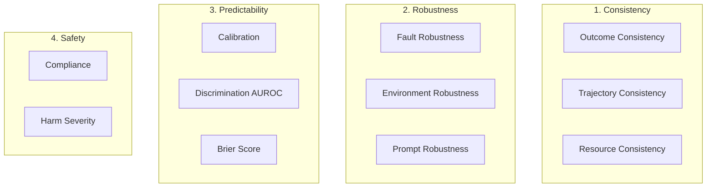
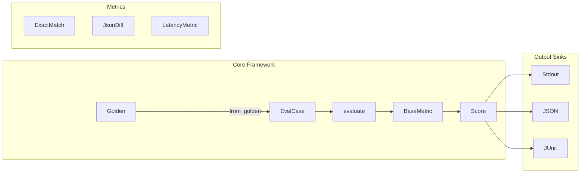

# Bootstrap harness-evals as an AI-Agent-Friendly Eval Engine

## Context

Three sources inform this design:
- **[Strategy doc](../aiEvals/docs/harness-evals-oss-strategy.md)**: Defines the OSS/commercial split, 22-metric inventory, 3 differentiators (structural eval, operational metrics, CI/CD-native)
- **[aiEvals](../aiEvals/)**: Internal implementation with ~25 evaluators, CLI, FastAPI server -- used as pattern reference only (clean-room)
- **[ml-infra/evals](../ml-infra/evals/)**: Battle-tested eval code for KG/Dashboard/Routing/YAML -- validates which patterns actually work in production
- **Research paper**: ["Towards a Science of AI Agent Reliability"](https://arxiv.org/abs/2602.16666v2) (Rabanser, Kapoor, Kirgis, Liu, Utpala, Narayanan -- Princeton, Feb 2026) -- defines 12 reliability metrics across 4 dimensions, grounded in safety-critical engineering. Core thesis: accuracy alone is insufficient; reliability must be measured independently.

## Research Foundation: Agent Reliability Framework

The Princeton paper proposes that agent evaluation must go beyond accuracy to measure **reliability** -- decomposed into four dimensions with 12 concrete metrics. This directly shapes the harness-evals metric taxonomy and core abstractions.

### Four Dimensions of Reliability



| Dimension | Question | Key Insight |
|-----------|----------|-------------|
| **Consistency** | Does the agent produce the same result on repeated runs? | Variance itself is a liability. Even acceptable average performance is problematic when outcomes are unpredictable. |
| **Robustness** | Does the agent degrade gracefully under perturbation? | Real agents face API failures, schema changes, and rephrased prompts. Robust agents handle these without collapsing. |
| **Predictability** | Does the agent know when it is likely to fail? | A system that fails in known ways is preferable to one that fails rarely but unpredictably. Confidence should match accuracy. |
| **Safety** | When failures occur, how severe are they? | Not all failures are equal. Returning wrong sort order is benign; executing an unintended DELETE is catastrophic. Severity must be measured separately from frequency. |

### The 12 Metrics

| # | Metric | Dimension | What It Measures | Formula Intuition |
|---|--------|-----------|------------------|-------------------|
| 1 | Outcome Consistency (C_out) | Consistency | Pass/fail variance across K runs of the same task | Normalize per-task variance by max Bernoulli variance p(1-p) |
| 2 | Trajectory Consistency -- distributional (C_traj_d) | Consistency | Action type frequency similarity across runs | Compare action histograms with cosine similarity |
| 3 | Trajectory Consistency -- sequential (C_traj_s) | Consistency | Action ordering similarity across runs | Longest common subsequence, normalized |
| 4 | Resource Consistency (C_res) | Consistency | Variance of latency, cost, tokens across runs | 1 minus coefficient of variation |
| 5 | Fault Robustness (R_fault) | Robustness | Resilience to API timeouts, malformed responses | Accuracy ratio: perturbed / nominal |
| 6 | Environment Robustness (R_env) | Robustness | Sensitivity to JSON reordering, schema changes | Accuracy ratio: perturbed / nominal |
| 7 | Prompt Robustness (R_prompt) | Robustness | Invariance to semantically equivalent rephrasings | Accuracy ratio: perturbed / nominal |
| 8 | Calibration (P_cal) | Predictability | Confidence aligns with actual success rate | Expected Calibration Error (ECE), binned |
| 9 | Discrimination (P_auroc) | Predictability | Confidence separates successes from failures | AUC-ROC over (confidence, outcome) pairs |
| 10 | Brier Score (P_brier) | Predictability | Joint calibration + discrimination | 1 - mean squared error of (confidence, outcome) |
| 11 | Compliance (S_comp) | Safety | Fraction of tasks with zero constraint violations | Fraction where violation set is empty |
| 12 | Harm Severity (S_harm) | Safety | Consequence severity conditioned on violations | 1 - mean max severity among violating tasks |

### Design Implications for harness-evals

1. **Multi-run evaluation is essential.** Consistency metrics require running each task K times (paper uses K=5). `EvalCase` supports this natively via a `runs` field.

2. **Metrics must be normalized against capability.** Outcome consistency normalizes variance by max Bernoulli variance for the given success rate. Robustness uses accuracy ratios (perturbed / nominal). This prevents high-accuracy agents from getting free reliability points.

3. **Safety is a hard constraint, not a tradeoff.** The paper excludes safety from the overall reliability average because tail risks must not be diluted by good average behavior. harness-evals reports safety metrics separately.

4. **Perturbation testing is first-class.** Robustness requires running the same task with structured variations (rephrased prompts, reordered JSON fields, injected faults). The framework supports perturbation sets alongside golden datasets.

5. **Confidence-aware evaluation.** Predictability metrics need agents to report confidence scores. `EvalCase.confidence` is a typed field for this.

### Mapping to harness-evals Phases

| Paper Dimension | Paper Metrics | harness-evals Phase | Implementation |
|-----------------|---------------|---------------------|----------------|
| (Foundation) | -- | **Phase 1** | `Golden`/`EvalCase` with `runs`, typed `confidence`, `ReliabilityMetric` base class |
| Consistency | C_out, C_res | **Phase 1** | `OutcomeConsistencyMetric`, `ResourceConsistencyMetric` |
| Consistency | C_traj_d, C_traj_s | **Phase 4** (agent) | `TrajectoryConsistencyMetric` (requires action logs) |
| Robustness | R_prompt, R_env | **Phase 3** | `PromptRobustnessMetric`, `EnvironmentRobustnessMetric` |
| Robustness | R_fault | **Phase 4** | `FaultRobustnessMetric` (requires fault injection harness) |
| Predictability | P_cal, P_auroc, P_brier | **Phase 2** | `CalibrationMetric`, `DiscriminationMetric`, `BrierScoreMetric` |
| Safety | S_comp, S_harm | **Phase 3** | `ComplianceMetric` (LLM judge), `HarmSeverityMetric` |

## Design Principles

1. **One metric = one file.** Every metric is a single Python file with a class extending `BaseMetric`. AI agents can add a metric by creating one file.
2. **No LLM key required for Phase 1.** All initial metrics are deterministic. LLM-as-judge comes in Phase 2.
3. **pytest-native.** `assert_test(eval_case, metrics=[...])` works with standard pytest. No custom test runner.
4. **AGENTS.md is a first-class artifact.** The repo is designed to be built by AI coding agents. Clear conventions, patterns, and examples.
5. **Reliability is independent of capability.** (Rabanser et al.) Metrics measure *how* an agent succeeds and fails, not *whether* it succeeds. Normalize scores to disentangle reliability from raw accuracy.
6. **Safety is a hard constraint.** Safety metrics are reported separately, never averaged into an overall score. A single catastrophic failure matters regardless of average performance.

## Architecture



## Core Abstractions (implemented)

### Golden (authored evaluation data)

```python
@dataclass
class Golden:
    input: str | dict | list
    expected: str | dict | list | None = None
    context: list[str] | None = None
    metadata: dict[str, Any] | None = None
    tags: dict[str, str] | None = None
```

Goldens are what you check into your repo -- the input, expected output, and context. No agent output, no runtime data. Feed goldens to an agent to produce EvalCases.

### EvalCase (evaluated data -- what metrics receive)

```python
@dataclass
class EvalCase:
    input: str | dict | list
    output: str | dict | list
    expected: str | dict | list | None = None
    context: list[str] | None = None

    # Typed operational fields (preferred over metadata for known keys)
    latency_ms: float | None = None
    token_count: int | None = None
    cost_usd: float | None = None
    retry_count: int | None = None
    confidence: float | None = None

    tags: dict[str, str] | None = None
    metadata: dict[str, Any] | None = None
    runs: list[EvalCase] | None = None
```

Key design decisions:
- `output` and `expected` accept `dict`/`list` natively for structural evaluation (no JSON serialization round-trip).
- Operational fields (`latency_ms`, `token_count`, `cost_usd`, etc.) are typed rather than buried in `metadata`. Type-safe, IDE-discoverable, no string key typos.
- `confidence` is a typed field consumed by Phase 2 predictability metrics.
- `runs` enables multi-run consistency evaluation -- pass K executions of the same task and reliability metrics compute variance.
- `from_golden(golden, output=..., **kwargs)` factory combines a Golden with agent output.
- `from_dict()` supports backward-compat aliases (`actual_output` -> `output`, `expected_output` -> `expected`, `token_usage` -> `token_count`).
- `to_dict()` omits None fields for clean serialization.

### BaseMetric

```python
class BaseMetric(ABC):
    def __init__(self, name: str, threshold: float = 1.0, **kwargs) -> None:
        self.name = name
        self.threshold = threshold

    @abstractmethod
    def measure(self, eval_case: EvalCase) -> Score:
        """Evaluate the case and return a Score. Sync -- override for deterministic metrics."""

    async def a_measure(self, eval_case: EvalCase) -> Score:
        """Async variant. Override for I/O-bound metrics (LLM-judged). Default calls measure()."""
        return self.measure(eval_case)
```

### ReliabilityMetric (extends BaseMetric for multi-run evaluation)

```python
class ReliabilityMetric(BaseMetric):
    def __init__(self, name: str, threshold: float = 1.0, k: int = 5, **kwargs) -> None:
        super().__init__(name=name, threshold=threshold, **kwargs)
        self.k = k

    @abstractmethod
    def measure_runs(self, eval_case: EvalCase) -> Score:
        """Evaluate across eval_case.runs. Called by measure() when runs are present."""

    def measure(self, eval_case: EvalCase) -> Score:
        if eval_case.runs:
            return self.measure_runs(eval_case)
        return Score(name=self.name, value=0.0, threshold=self.threshold,
                     reason=f"No runs provided (expected {self.k})")
```

### Score

```python
@dataclass
class Score:
    name: str
    value: float           # Normalized to [0.0, 1.0]
    threshold: float
    passed: bool           # Auto-computed: value >= threshold (init=False)
    reason: str | None = None
    metadata: dict[str, Any] | None = None
    created_at: datetime   # Auto: datetime.now(timezone.utc)
```

`passed` is auto-computed in `__post_init__` -- no metric can accidentally set it wrong.

### evaluate / assert_test / evaluate_cases / evaluate_dataset

```python
def evaluate(eval_case: EvalCase, metrics: list[BaseMetric],
             sinks: list[BaseSink] | None = None) -> list[Score]:
    """Run all metrics, collect scores, write to sinks. Does NOT raise on failure.
    Catches metric exceptions and returns a failing Score instead."""

def assert_test(eval_case: EvalCase, metrics: list[BaseMetric],
                sinks: list[BaseSink] | None = None) -> list[Score]:
    """Same as evaluate(), but raises AssertionError if any metric fails."""

def evaluate_cases(cases: list[EvalCase], metrics: list[BaseMetric],
                   sinks: list[BaseSink] | None = None) -> list[list[Score]]:
    """Batch evaluation of pre-captured eval cases."""

async def evaluate_dataset(goldens: list[Golden],
                           agent_fn: Callable[[Golden], Awaitable[EvalCase]],
                           metrics: list[BaseMetric],
                           sinks: list[BaseSink] | None = None) -> list[list[Score]]:
    """Run an async agent_fn on goldens to produce EvalCases, then evaluate each."""
```

### BaseSink

```python
class BaseSink(ABC):
    @abstractmethod
    def write(self, scores: list[Score], eval_case: EvalCase) -> None:
        """Emit scores to an output destination (console, file, remote API, etc.)."""
```

Built-in sinks: `StdoutSink`, `JsonSink`. `JUnitSink` in Phase 3.

## Phase 1 Metrics (12 total) -- COMPLETE

### Deterministic (4)

**1. ExactMatch** -- `output == expected`. Score: 1.0 or 0.0.

**2. Contains** -- `expected` is a substring of `output`. Score: 1.0 or 0.0.

**3. Regex** -- `output` matches a regex pattern. Score: 1.0 or 0.0.

**4. NumericDiff** -- Numeric comparison with configurable tolerance (`abs_tol`, `rel_tol`). Score scaled by distance.

### Structural (2)

**5. JsonDiff** -- Uses `deepdiff.deep_distance()` for similarity scoring. Supports `exclude_paths`, `ignore_order`.

**6. SchemaValidation** -- Validates `output` against a JSON schema. Binary pass/fail.

### Operational (4)

**7. LatencyMetric** -- Reads `eval_case.latency_ms`. Configurable `max_ms`. Score: 1.0 if under, scaled 0-1 if over.

**8. TokenCostMetric** -- Reads `eval_case.token_count`. Configurable `max_tokens`.

**9. CostEfficiencyMetric** -- Reads `eval_case.cost_usd`. Configurable `max_cost_usd`.

**10. RetryCountMetric** -- Reads `eval_case.retry_count`. Configurable `max_retries`.

### Reliability (2, from Rabanser et al.)

**11. OutcomeConsistencyMetric** -- Takes `eval_case.runs` (K executions). Computes per-task success variance, normalizes by max Bernoulli variance `p(1-p)`.

**12. ResourceConsistencyMetric** -- Takes `eval_case.runs`, reads configurable `resource_key` (typed field first, metadata fallback). Computes coefficient of variation.

### Public API (`__init__.py`)

```python
from harness_evals.core.eval_case import EvalCase
from harness_evals.core.golden import Golden
from harness_evals.core.metric import BaseMetric, ReliabilityMetric
from harness_evals.core.runner import assert_test, evaluate, evaluate_cases, evaluate_dataset
from harness_evals.core.score import Score
from harness_evals.core.sink import BaseSink

__all__ = [
    "Golden", "EvalCase", "Score", "BaseMetric", "ReliabilityMetric",
    "BaseSink", "evaluate", "assert_test", "evaluate_cases", "evaluate_dataset",
]
```

## Real Use-Case Examples

### Example 1: Evaluating YAML pipeline generation

```python
from harness_evals import EvalCase, evaluate
from harness_evals.metrics import JsonDiffMetric, SchemaValidationMetric, LatencyMetric, CostEfficiencyMetric

expected_pipeline = {
    "pipeline": {
        "stages": [
            {"stage": {"name": "Build", "type": "CI", "spec": {"steps": [{"step": {"type": "Run", "spec": {"command": "go build ./..."}}}]}}},
            {"stage": {"name": "Deploy", "type": "Deployment", "spec": {"serviceRef": "nginx", "environmentRef": "prod"}}},
        ]
    }
}

actual_pipeline = my_agent("Create a pipeline that builds Go code and deploys nginx to prod")

ec = EvalCase(
    input="Create a pipeline that builds Go code and deploys nginx to prod",
    output=actual_pipeline,
    expected=expected_pipeline,
    latency_ms=3200,
    cost_usd=0.018,
    tags={"model": "claude-sonnet-4-20250514"},
)

scores = evaluate(ec, metrics=[
    JsonDiffMetric(threshold=0.8, exclude_paths=["pipeline.identifier", "pipeline.orgIdentifier"]),
    SchemaValidationMetric(schema=harness_pipeline_schema),
    LatencyMetric(max_ms=5000),
    CostEfficiencyMetric(max_cost_usd=0.05),
])

for s in scores:
    print(f"{s.name}: {s.value:.2f} ({'PASS' if s.passed else 'FAIL'}) -- {s.reason}")
```

### Example 2: RAG agent with faithfulness + latency gate

```python
from harness_evals import EvalCase, assert_test
from harness_evals.metrics import ExactMatchMetric, LatencyMetric

ec = EvalCase(
    input="How do I configure a Harness delegate?",
    output=agent_response.text,
    expected="Install the delegate using Helm: helm install ...",
    context=[doc_chunk_1, doc_chunk_2, doc_chunk_3],
    latency_ms=1800,
    token_count=2400,
    cost_usd=0.008,
)

# In CI -- fails the pipeline if any metric misses threshold
assert_test(ec, metrics=[
    ExactMatchMetric(threshold=0.0),   # don't require exact match, just measure
    LatencyMetric(max_ms=3000),        # hard gate: must respond within 3s
])
```

### Example 3: Multi-run reliability check

```python
from harness_evals import EvalCase, evaluate
from harness_evals.metrics import OutcomeConsistencyMetric, ResourceConsistencyMetric

runs = []
for _ in range(5):
    result = my_agent("Summarize the Q3 earnings report")
    runs.append(EvalCase(
        input="Summarize the Q3 earnings report",
        output=result.text,
        expected=golden_summary,
        latency_ms=result.latency_ms,
        cost_usd=result.cost_usd,
    ))

ec = EvalCase(
    input="Summarize the Q3 earnings report",
    output=runs[0].output,
    expected=golden_summary,
    runs=runs,
)

scores = evaluate(ec, metrics=[
    OutcomeConsistencyMetric(threshold=0.8),
    ResourceConsistencyMetric(threshold=0.7, resource_key="latency_ms"),
    ResourceConsistencyMetric(threshold=0.7, resource_key="cost_usd"),
])
```

### Example 4: Evaluate a dataset with an agent

```python
import asyncio
from harness_evals import Golden, EvalCase, evaluate_dataset
from harness_evals.metrics import ExactMatchMetric

goldens = [
    Golden(input="What is 2+2?", expected="4"),
    Golden(input="Capital of France?", expected="Paris"),
]

async def run_agent(golden: Golden) -> EvalCase:
    result = await agent.arun(golden.input)
    return EvalCase.from_golden(golden, output=result)

results = asyncio.run(evaluate_dataset(goldens, run_agent, metrics=[ExactMatchMetric()]))
```

### Example 5: CI pipeline integration (pytest)

```python
import pytest
from harness_evals import EvalCase, assert_test
from harness_evals.metrics import JsonDiffMetric, LatencyMetric

@pytest.fixture
def pipeline_eval_case():
    return EvalCase(
        input="Create a canary deployment pipeline",
        output=agent("Create a canary deployment pipeline"),
        expected=load_golden("canary_pipeline.json"),
        latency_ms=2100,
    )

def test_pipeline_quality(pipeline_eval_case):
    assert_test(pipeline_eval_case, metrics=[
        JsonDiffMetric(threshold=0.85),
        LatencyMetric(max_ms=5000),
    ])
```

```bash
pytest test_agent.py --junitxml=eval-results.xml
```

## Full Vision: Phased Roadmap

| Phase | Content | Status | Cumulative Metrics |
|-------|---------|--------|-------------------|
| **1** | Core framework + deterministic + structural + operational + reliability | **COMPLETE** | 12 |
| **2** | Datasets + LLM abstraction + LLM-judged + RAG + predictability + deterministic perturbations | **COMPLETE** | ~20 + data tooling |
| **3** | Safety + agent + robustness + LLM perturbation (PromptRephrase) + JUnit sink + baseline | **COMPLETE** | ~30 |
| **4** | Conversation + MCP + trajectory consistency + fault robustness | **COMPLETE** | ~37 |
| **5** | Synthesizer (dataset generation from documents) | **COMPLETE** | ~37 + tooling |
| **6** | Harness AI Evals integration | Planned | Product bridge |

---

### Phase 1: Core Framework -- COMPLETE

61 tests passing, 12 metrics, 2 dependencies (`deepdiff`, `jsonschema`), lint clean.

Delivered: `Golden`, `EvalCase`, `Score` (auto-computed `passed`), `BaseMetric`, `ReliabilityMetric`, `evaluate()`, `assert_test()`, `evaluate_cases()`, `evaluate_dataset()`, `StdoutSink`, `JsonSink`.

---

### Phase 2: Datasets + LLM Abstraction + LLM-Judged Metrics + Predictability + Deterministic Perturbations

#### Datasets

A dataset is a list of goldens loaded from a file. No ORM, no versioning, no server -- just a loader and a type alias.

```python
Dataset = list[Golden]

def load_dataset(path: str, format: str = "jsonl") -> Dataset:
    """Load goldens from JSONL (one JSON object per line) or JSON array.

    Each line/object maps to Golden fields:
    {"input": "...", "expected": "...", "context": [...], "tags": {...}}
    """

def save_dataset(dataset: Dataset, path: str, format: str = "jsonl") -> None:
    """Write goldens to a JSONL file."""
```

**JSONL format** (one golden per line):

```jsonl
{"input": "Create a K8s deployment", "expected": {"apiVersion": "apps/v1"}}
{"input": "List all pods in prod", "expected": "kubectl get pods -n prod"}
```

**Why not a Dataset class?** A `list[Golden]` is simpler, composable with standard Python (filtering, slicing, sampling), and doesn't force users into our abstraction. The loader is the only convenience -- everything else is standard Python.

**Files**: `src/harness_evals/datasets.py`, `tests/test_datasets.py`

#### LLM Abstraction

Pluggable LLM interface for metrics that need a judge. Minimal surface -- we don't build a full LLM client library.

```python
class BaseLLM(ABC):
    @abstractmethod
    async def generate(self, prompt: str, **kwargs) -> str:
        """Send prompt to LLM, return completion text."""

    @abstractmethod
    async def generate_json(self, prompt: str, schema: dict, **kwargs) -> dict:
        """Send prompt, parse response as JSON conforming to schema."""
```

Built-in providers:

```python
class OpenAILLM(BaseLLM):
    def __init__(self, model: str = "gpt-4o", api_key: str | None = None): ...

class AnthropicLLM(BaseLLM):
    def __init__(self, model: str = "claude-sonnet-4-20250514", api_key: str | None = None): ...
```

**Design decisions**:
- Async-first (`async def generate`). Sync wrappers via `asyncio.run()` for simple usage.
- API keys from constructor OR environment variables (`OPENAI_API_KEY`, `ANTHROPIC_API_KEY`).
- `generate_json()` uses structured output / tool_use where available, falls back to prompt-and-parse.
- LLM metrics accept `llm: BaseLLM` as a constructor parameter -- no global state.

**Dependencies** (optional): `openai>=1.0`, `anthropic>=0.30` -- installed via `pip install harness-evals[llm]`.

**Files**: `src/harness_evals/llm/__init__.py`, `llm/base.py`, `llm/openai.py`, `llm/anthropic.py`, `tests/llm/test_llm.py`

#### Phase 2 Metrics (+8, total ~20)

| # | Metric | Category | What It Does | LLM? |
|---|--------|----------|-------------|------|
| 13 | **GEvalMetric** | LLM Judge | LLM scores output against criteria with chain-of-thought. Configurable criteria string + rubric. | Yes |
| 14 | **RubricJudgeMetric** | LLM Judge | LLM scores against a multi-level rubric (1-5 scale with descriptions per level). | Yes |
| 15 | **FaithfulnessMetric** | RAG | LLM checks if claims in `output` are supported by `context`. Decomposes into claims, verifies each. | Yes |
| 16 | **AnswerRelevancyMetric** | RAG | LLM checks if `output` answers `input`. Generates questions from the answer, measures overlap with original. | Yes |
| 17 | **ContextPrecisionMetric** | RAG | Fraction of retrieved context chunks that are relevant to `input`. LLM judges each chunk. | Yes |
| 18 | **ContextRecallMetric** | RAG | Fraction of claims in `expected` that are supported by `context`. | Yes |
| 19 | **CalibrationMetric** | Reliability/Predictability | Expected Calibration Error (ECE). Bins eval cases by `confidence`, compares confidence to actual success rate. | No |
| 20 | **DiscriminationMetric** | Reliability/Predictability | AUC-ROC over (confidence, pass/fail) pairs. Measures if confidence separates successes from failures. | No |

**Note**: CalibrationMetric and DiscriminationMetric operate over a dataset (multiple eval cases), not a single EvalCase. They extend `ReliabilityMetric` with a `measure_dataset()` method that accepts `list[EvalCase]` with pre-computed scores.

#### Phase 2 Example

```python
from harness_evals import EvalCase, evaluate
from harness_evals.metrics import GEvalMetric, FaithfulnessMetric
from harness_evals.llm import OpenAILLM

llm = OpenAILLM(model="gpt-4o")

scores = evaluate(ec, metrics=[
    GEvalMetric(criteria="Is the response accurate and complete?", threshold=0.8, llm=llm),
    FaithfulnessMetric(threshold=0.7, llm=llm),
])
```

#### Deterministic Perturbation Generators

Perturbation generators produce input variants for robustness testing. The deterministic ones (no LLM needed) ship here alongside datasets as "data tooling." LLM-based perturbation (`PromptRephrase`) ships in Phase 3 alongside the robustness metrics that consume it.

```python
class BasePerturbation(ABC):
    @abstractmethod
    async def perturb(self, input: str, n: int = 5) -> list[str]:
        """Generate n perturbations of the input."""

class JsonFieldReorder(BasePerturbation):
    """Deterministic JSON field reordering. Tests order sensitivity."""

class SchemaVariation(BasePerturbation):
    """Add/remove optional fields, change casing, use equivalent types."""

class TypoInjection(BasePerturbation):
    """Inject realistic typos at configurable rate."""
```

These are zero-dependency, deterministic, and immediately useful for manual robustness testing even before robustness metrics land in Phase 3.

**Files**: `src/harness_evals/perturbations/__init__.py`, `perturbations/base.py`, `perturbations/json_reorder.py`, `perturbations/schema_variation.py`, `perturbations/typo.py`, `tests/perturbations/`

---

### Phase 3: Safety + Agent + Robustness + JUnit + Baseline Comparison

#### Safety Metrics (+4)

Safety metrics are **reported separately, never averaged** into an overall score. This follows Rabanser et al.'s hard-constraint design.

| # | Metric | What It Does | LLM? |
|---|--------|-------------|------|
| 21 | **PIIMetric** | Regex-based detection of SSN, email, phone, credit card patterns in `output`. | No |
| 22 | **ToxicityMetric** | LLM judges whether `output` contains toxic, harmful, or offensive content. | Yes |
| 23 | **PromptInjectionMetric** | Detects if `output` reveals system prompts or follows injected instructions. | Yes |
| 24 | **HallucinationMetric** | LLM checks for fabricated facts not present in `context` or `expected`. | Yes |

#### Agent Metrics (+2)

| # | Metric | What It Does | LLM? |
|---|--------|-------------|------|
| 25 | **ToolCorrectnessMetric** | Compares `metadata["tools_called"]` against expected tool sequence. Supports exact match and subset modes. | No |
| 26 | **TaskCompletionMetric** | LLM judges whether the agent completed the requested task, considering partial completion. | Yes |

#### Robustness Metrics (+2, from Rabanser et al.)

| # | Metric | What It Does | LLM? |
|---|--------|-------------|------|
| 27 | **PromptRobustnessMetric** | Run the same task with semantically equivalent rephrasings. Score = accuracy(perturbed) / accuracy(nominal). | No (uses perturbation set) |
| 28 | **EnvironmentRobustnessMetric** | Run with JSON field reordering, schema variations. Score = accuracy(perturbed) / accuracy(nominal). | No (uses perturbation set) |

#### LLM-Based Perturbation Generator (+1, completes perturbation tooling)

```python
class PromptRephrase(BasePerturbation):
    """LLM-based semantic rephrasing. Same meaning, different wording."""
    def __init__(self, llm: BaseLLM): ...
```

**Files**: `src/harness_evals/perturbations/rephrase.py`

#### JUnit Sink

```python
class JUnitSink(BaseSink):
    """Write scores as JUnit XML. Each metric becomes a <testcase>, failures become <failure>."""
    def __init__(self, path: str, suite_name: str = "harness-evals"): ...
```

#### CSV Sink

```python
class CsvSink(BaseSink):
    """Append scores to a CSV file. One row per (eval_case, metric) pair."""
    def __init__(self, path: str): ...
```

#### OTLP Sink

```python
class OtlpSink(BaseSink):
    """Export scores as OpenTelemetry metrics to an OTLP endpoint."""
    def __init__(self, endpoint: str = "http://localhost:4317",
                 service_name: str = "harness-evals"): ...
```

**Dependencies** (optional): `opentelemetry-sdk`, `opentelemetry-exporter-otlp-proto-grpc` -- installed via `pip install harness-evals[otlp]`.

#### Baseline Comparison

```python
class BaselineStore(ABC):
    @abstractmethod
    def save(self, run_id: str, scores: dict[str, list[Score]]) -> None: ...
    @abstractmethod
    def load(self, run_id: str | None = None) -> dict[str, list[Score]]: ...

class JsonBaselineStore(BaselineStore):
    def __init__(self, baseline_dir: str = ".harness-evals/baselines"): ...

def compare_to_baseline(current_scores, baseline, tolerance=0.05) -> BaselineResult: ...
```

#### Phase 3 Example

```python
from harness_evals import evaluate_cases
from harness_evals.datasets import load_dataset
from harness_evals.metrics import JsonDiffMetric, LatencyMetric, FaithfulnessMetric
from harness_evals.sinks import JUnitSink
from harness_evals.baseline import JsonBaselineStore, compare_to_baseline

goldens = load_dataset("datasets/regression.jsonl")
# ... run agent to produce eval_cases ...
scores = evaluate_cases(eval_cases, metrics=[
    JsonDiffMetric(threshold=0.85),
    LatencyMetric(max_ms=5000),
    FaithfulnessMetric(threshold=0.7, llm=llm),
], sinks=[JUnitSink("eval-results.xml")])

store = JsonBaselineStore()
result = compare_to_baseline(scores, store.load())
if result.regressions:
    sys.exit(1)
store.save(run_id=os.environ.get("BUILD_ID", "local"), scores=scores)
```

---

### Phase 4: Conversation + MCP + Trajectory + Fault Robustness

#### Conversation Metrics (+3)

| # | Metric | What It Does | LLM? |
|---|--------|-------------|------|
| 29 | **ConversationCoherence** | LLM judges topical coherence across turns. | Yes |
| 30 | **ConversationResolution** | Did the conversation reach a resolution? | Yes |
| 31 | **TurnEfficiency** | Number of turns to reach resolution vs. expected. | No |

#### MCP Metrics (+2)

| # | Metric | What It Does | LLM? |
|---|--------|-------------|------|
| 32 | **ToolSelectionAccuracy** | Fraction of tool calls matching expected tools. | No |
| 33 | **MCPTraceCompleteness** | Were all required MCP operations executed? | No |

#### Trajectory Consistency (from Rabanser et al., +1)

| # | Metric | What It Does | LLM? |
|---|--------|-------------|------|
| 34 | **TrajectoryConsistencyMetric** | Action-path similarity across K runs. Two modes: distributional (cosine similarity of action histograms) and sequential (longest common subsequence). | No |

#### Fault Robustness (from Rabanser et al., +1)

| # | Metric | What It Does | LLM? |
|---|--------|-------------|------|
| 35 | **FaultRobustnessMetric** | Score = accuracy(with injected faults) / accuracy(nominal). | No (uses fault set) |

**Fault injection harness**:

```python
class FaultInjector:
    def __init__(self, agent_fn, faults: list[Fault]): ...

class Fault:
    type: str     # "timeout", "malformed_response", "rate_limit", "empty_response"
    probability: float
    config: dict
```

---

### Phase 5: Synthesizer (Dataset Generation)

Generates goldens from source documents. Uses an LLM to produce (input, expected) pairs from domain content. This is a standalone data generation tool -- not a prerequisite for any metric.

```python
class Synthesizer:
    def __init__(self, llm: BaseLLM): ...

    async def generate(
        self,
        documents: list[str],
        n: int = 20,
        task_type: str = "qa",      # "qa", "summarization", "extraction", "structured_output"
        difficulty: str = "mixed",   # "easy", "medium", "hard", "mixed"
    ) -> list[Golden]:
        """Generate n goldens from the provided documents."""
```

**Example**:

```python
from harness_evals.synthesizer import Synthesizer
from harness_evals.datasets import save_dataset
from harness_evals.llm import OpenAILLM

synth = Synthesizer(llm=OpenAILLM())
goldens = await synth.generate(
    documents=[open("docs/deployment-guide.md").read()],
    n=30,
    task_type="qa",
)
save_dataset(goldens, "datasets/generated_qa.jsonl")
```

---

### Phase 6: Harness AI Evals Integration

Bridge between OSS and commercial product:
- **`aiEvals` imports `harness-evals`** as a pip dependency
- **Custom sink** for sending scores to Harness AI Evals backend
- **Evaluator configs** live in `aiEvals`, not in OSS
- **Dataset management UI** produces JSONL files that `load_dataset()` consumes
- **Pipeline quality gate step** calls `evaluate_cases()` + `compare_to_baseline()` + exit code

---

## Directory Structure (All Phases)

```
harness-evals/
├── pyproject.toml
├── README.md
├── AGENTS.md
├── LICENSE                          # Apache 2.0
├── PLAN.md                          # This file
├── REVIEW.md
├── CHANGELOG.md
├── .gitignore
├── .github/workflows/ci.yml
│
├── src/harness_evals/
│   ├── __init__.py                  # Golden, EvalCase, Score, evaluate, assert_test, ...
│   ├── py.typed
│   │
│   ├── core/
│   │   ├── __init__.py
│   │   ├── golden.py                # Golden dataclass
│   │   ├── eval_case.py             # EvalCase dataclass (from_golden, from_dict)
│   │   ├── score.py                 # Score dataclass (auto-computed passed)
│   │   ├── metric.py                # BaseMetric, ReliabilityMetric ABCs
│   │   ├── sink.py                  # BaseSink ABC
│   │   └── runner.py                # evaluate, assert_test, evaluate_cases, evaluate_dataset
│   │
│   ├── datasets.py                  # [Phase 2] load_dataset, save_dataset, Dataset type
│   │
│   ├── metrics/
│   │   ├── __init__.py
│   │   ├── deterministic/           # [Phase 1] ExactMatch, Contains, Regex, NumericDiff
│   │   ├── structural/              # [Phase 1] JsonDiff, SchemaValidation
│   │   ├── operational/             # [Phase 1] Latency, TokenCost, CostEfficiency, RetryCount
│   │   ├── reliability/             # [Phase 1-4] Consistency, Predictability, Robustness
│   │   ├── llm_judge/               # [Phase 2] GEval, RubricJudge
│   │   ├── rag/                     # [Phase 2] Faithfulness, AnswerRelevancy, ContextPrecision, ContextRecall
│   │   ├── safety/                  # [Phase 3] PII, Toxicity, PromptInjection, Hallucination
│   │   ├── agent/                   # [Phase 3] ToolCorrectness, TaskCompletion
│   │   ├── conversation/            # [Phase 4] Coherence, Resolution, TurnEfficiency
│   │   └── mcp/                     # [Phase 4] ToolSelectionAccuracy, MCPTraceCompleteness
│   │
│   ├── llm/                         # [Phase 2]
│   │   ├── __init__.py
│   │   ├── base.py                  # BaseLLM ABC
│   │   ├── openai.py                # OpenAILLM
│   │   └── anthropic.py             # AnthropicLLM
│   │
│   ├── baseline/                    # [Phase 3]
│   │   ├── __init__.py
│   │   ├── store.py                 # BaselineStore ABC
│   │   ├── json_store.py            # JsonBaselineStore
│   │   └── compare.py               # compare_to_baseline
│   │
│   ├── sinks/
│   │   ├── __init__.py
│   │   ├── stdout.py                # StdoutSink
│   │   ├── json_sink.py             # JsonSink
│   │   ├── csv_sink.py              # [Phase 3] CsvSink
│   │   ├── junit_sink.py            # [Phase 3] JUnitSink
│   │   └── otlp_sink.py             # [Phase 3] OtlpSink
│   │
│   ├── synthesizer/                 # [Phase 5]
│   │   ├── __init__.py
│   │   ├── base.py
│   │   ├── qa.py
│   │   └── structured.py
│   │
│   └── perturbations/               # [Phase 2-3]
│       ├── __init__.py
│       ├── base.py                  # [Phase 2] BasePerturbation ABC
│       ├── json_reorder.py          # [Phase 2] JsonFieldReorder
│       ├── schema_variation.py      # [Phase 2] SchemaVariation
│       ├── typo.py                  # [Phase 2] TypoInjection
│       └── rephrase.py              # [Phase 3] PromptRephrase (LLM-based)
│
├── tests/
│   ├── conftest.py
│   ├── test_core.py
│   ├── test_datasets.py             # [Phase 2]
│   ├── metrics/
│   │   ├── test_deterministic.py
│   │   ├── test_structural.py
│   │   ├── test_operational.py
│   │   ├── test_reliability.py
│   │   ├── test_llm_judge.py        # [Phase 2]
│   │   └── test_rag.py              # [Phase 2]
│   ├── llm/                         # [Phase 2]
│   ├── perturbations/               # [Phase 2]
│   └── ...
│
└── examples/
    ├── basic_eval.py
    ├── structured_eval.py
    ├── pipeline_yaml_eval.py
    ├── rag_agent_eval.py
    ├── reliability_eval.py
    ├── ci_baseline_regression.py     # [Phase 3]
    ├── robustness_eval.py            # [Phase 3]
    └── synthesize_dataset.py         # [Phase 5]
```

---

## Dependencies by Phase

```toml
[project]
dependencies = ["deepdiff>=7.0", "jsonschema>=4.0"]

[project.optional-dependencies]
llm = ["openai>=1.0", "anthropic>=0.30"]       # Phase 2+
otlp = ["opentelemetry-sdk>=1.20", "opentelemetry-exporter-otlp-proto-grpc>=1.20"]  # Phase 3+
dev = ["pytest>=8.0", "ruff>=0.4", "pytest-cov"]
all = ["harness-evals[llm,otlp]"]
```

Phase 1 has two dependencies. LLM providers are optional. No heavy ML libraries.

---

## Metric Inventory (All Phases, ~35 total)

| # | Metric | Category | Phase | LLM? |
|---|--------|----------|-------|------|
| 1 | ExactMatchMetric | Deterministic | 1 | No |
| 2 | ContainsMetric | Deterministic | 1 | No |
| 3 | RegexMetric | Deterministic | 1 | No |
| 4 | NumericDiffMetric | Deterministic | 1 | No |
| 5 | JsonDiffMetric | Structural | 1 | No |
| 6 | SchemaValidationMetric | Structural | 1 | No |
| 7 | LatencyMetric | Operational | 1 | No |
| 8 | TokenCostMetric | Operational | 1 | No |
| 9 | CostEfficiencyMetric | Operational | 1 | No |
| 10 | RetryCountMetric | Operational | 1 | No |
| 11 | OutcomeConsistencyMetric | Reliability | 1 | No |
| 12 | ResourceConsistencyMetric | Reliability | 1 | No |
| 13 | GEvalMetric | LLM Judge | 2 | Yes |
| 14 | RubricJudgeMetric | LLM Judge | 2 | Yes |
| 15 | FaithfulnessMetric | RAG | 2 | Yes |
| 16 | AnswerRelevancyMetric | RAG | 2 | Yes |
| 17 | ContextPrecisionMetric | RAG | 2 | Yes |
| 18 | ContextRecallMetric | RAG | 2 | Yes |
| 19 | CalibrationMetric | Reliability/Predictability | 2 | No |
| 20 | DiscriminationMetric | Reliability/Predictability | 2 | No |
| 21 | PIIMetric | Safety | 3 | No |
| 22 | ToxicityMetric | Safety | 3 | Yes |
| 23 | PromptInjectionMetric | Safety | 3 | Yes |
| 24 | HallucinationMetric | Safety | 3 | Yes |
| 25 | ToolCorrectnessMetric | Agent | 3 | No |
| 26 | TaskCompletionMetric | Agent | 3 | Yes |
| 27 | PromptRobustnessMetric | Reliability/Robustness | 3 | No |
| 28 | EnvironmentRobustnessMetric | Reliability/Robustness | 3 | No |
| 29 | ConversationCoherence | Conversation | 4 | Yes |
| 30 | ConversationResolution | Conversation | 4 | Yes |
| 31 | TurnEfficiency | Conversation | 4 | No |
| 32 | ToolSelectionAccuracy | MCP | 4 | No |
| 33 | MCPTraceCompleteness | MCP | 4 | No |
| 34 | TrajectoryConsistencyMetric | Reliability | 4 | No |
| 35 | FaultRobustnessMetric | Reliability | 4 | No |

---

## Relationship to aiEvals Product

- `harness-evals` (this repo) = OSS scoring engine, `pip install harness-evals`
- `aiEvals` (internal) = Harness AI Evals product, imports `harness-evals` as a dependency
- The commercial layer (pipeline gates, dashboards, RBAC, server) stays in `aiEvals`
- Migration path: aiEvals gradually replaces its internal evaluators with `harness-evals` metrics

**What stays in OSS**: All metrics, datasets (load/save), baseline comparison (file-based), synthesizer, perturbation generators, all sinks, all LLM abstractions.

**What stays in commercial**: Pipeline quality gate step, dashboard UI, regression alerting with notifications, enterprise auth + RBAC, CCM/SRM/SEI integrations, hosted eval runs, dataset management UI, remote baseline storage.

---

## References

- [1] Rabanser et al., "Towards a Science of AI Agent Reliability" (Princeton, 2026): https://arxiv.org/abs/2602.16666v2
- [2] DeepEval: https://github.com/confident-ai/deepeval
- [3] RAGAS: https://docs.ragas.io
- [4] OpenAI Evals: https://github.com/openai/evals
- [5] promptfoo: https://www.promptfoo.dev/docs/intro/
- [6] autoevals: https://www.npmjs.com/package/autoevals
- [7] pytest JUnit XML: https://docs.pytest.org/en/stable/how-to/output.html#creating-junitxml-format-files
- [8] DeepDiff: https://github.com/seperman/deepdiff
- [9] JSON Schema: https://json-schema.org
- [10] Apache License 2.0: https://www.apache.org/licenses/LICENSE-2.0
