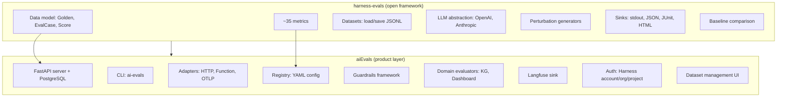
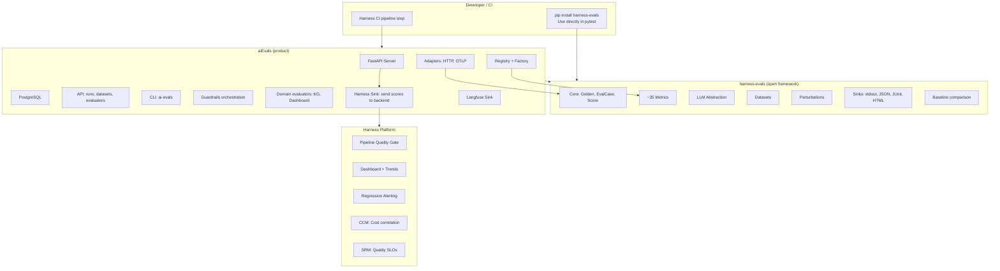

# harness-evals + aiEvals: Integration Architecture

## Context

Two codebases exist today:

| | **harness-evals** | **aiEvals** |
|---|---|---|
| **What** | Open evaluation framework / scoring engine | Internal Harness AI Evals product |
| **Install** | `pip install harness-evals` | Internal package + FastAPI server |
| **Scope** | Metrics, data model, datasets, sinks, LLM abstraction, perturbations | Server, API, CLI, adapters, registry, evaluators, guardrails, DB |
| **License** | Apache 2.0 | Internal |
| **Dependencies** | `deepdiff`, `jsonschema` (core); `openai`, `anthropic` (optional) | `autoevals`, `pydantic`, `typer`, `aiohttp`, FastAPI, SQLAlchemy, asyncpg |

The goal: **harness-evals becomes the scoring engine that aiEvals uses under the hood.** aiEvals remains the product layer — server, API, CLI, pipeline gates, dashboards, adapters. harness-evals provides the metrics, data model, and evaluation logic.



---

## What Exists in Each Codebase Today

### aiEvals — Evaluators

aiEvals has ~25 evaluators across several categories:

| Category | Evaluators | Implementation |
|----------|-----------|----------------|
| **Deterministic** | ExactMatch, Contains, RegexMatch | Native (`deterministic.py`) |
| **Structural** | DeepDiff (v1/v2/v3), SchemaValidation | Native (`deep_diff*.py`, `schema_validation.py`) |
| **Numeric** | NumericDiff, NumericDiffAbsolute | Native (`numeric_similarity.py`) |
| **Operational** | Latency, TokenUsage, ToolCall | Native (`metrics.py`) |
| **LLM Judge** | LLMJudge (rubric-based) | Native (`llm_judge.py`) via `LLMRubricJudge` |
| **Autoevals wrappers** | Factuality, Helpfulness, Levenshtein, BLEU, EmbeddingSimilarity, RAGRelevance | Wraps `autoevals` package (`autoevals.py`) |
| **RAG (via autoevals)** | Faithfulness, AnswerRelevancy, ContextPrecision, ContextRecall, + 4 more | `@builtin/ragas/*` in catalog.yaml → `autoevals.ragas` |
| **Guardrails** | Toxicity, Hallucination, PII, PromptInjection, SensitiveData, Regex, Keyword | Native (`guardrails/*.py`) |
| **Domain-specific** | KnowledgeGraph, Dashboard, EnrichedOutput | Native — Harness-specific |

### aiEvals — Infrastructure

| Component | What It Does | File |
|-----------|-------------|------|
| **Evaluator ABC** | `score(generated, expected, metadata) -> Score` | `evaluators/base.py` |
| **Score type** | `name`, `value`, `eval_id`, `run_id`, `comment`, `metadata`, `value_type` | `sdk/types/score.py` |
| **DatasetItem** | `id`, `input`, `expected`, `tags`, `metadata` | `sdk/types/dataset.py` |
| **EvalRegistryEntry** | `eval_id`, `evaluator`, `score_name`, `thresholds`, `config`, `environments` | `sdk/types/registry.py` |
| **EvaluationRunner** | Load registry → load evaluator → run on dataset → emit to sinks | `runner/engine.py` |
| **Adapters** | HTTP, SSE, Function, OTLP — call agents and capture output | `adapters/` |
| **Sinks** | Stdout, JSON, CSV, JUnit, Langfuse | `sdk/sinks/` |
| **LLM Judge** | `LLMRubricJudge` with OpenAI/Anthropic | `sdk/judges/llm_judge.py` |
| **Builtin resolver** | `@builtin/<name>` → catalog.yaml → autoevals/harness adapters | `evaluators/builtins/` |
| **Server** | FastAPI with runs, datasets, evaluators, agent-configs CRUD | `api/` |
| **CLI** | `ai-evals run`, `ai-evals compare`, `ai-evals baseline` | `runner/cli.py` |
| **Evaluator factory** | `build_evaluator(type, config)` — llm, heuristic, code, composite | `api/factories/` |

### harness-evals — What It Provides

| Component | What It Does | What aiEvals Lacks |
|-----------|-------------|-------------------|
| **Golden** | Authored test data — input, expected, context, metadata, tags | aiEvals has `DatasetItem` but no `Golden` → `EvalCase` flow |
| **EvalCase** | What metrics receive — output, typed operational fields, confidence, runs | aiEvals passes raw `(generated, expected, metadata)` tuples |
| **Score** | Auto-computed `passed` from `value >= threshold` | aiEvals Score has no auto-computed pass/fail |
| **BaseMetric** | `measure(eval_case) -> Score` with sync + async | aiEvals uses `score(generated, expected, metadata)` |
| **ReliabilityMetric** | Multi-run evaluation via `measure_runs()` | Not in aiEvals |
| **evaluate / assert_test** | Run multiple metrics, collect scores, catch exceptions | aiEvals runs one evaluator per run |
| **Reliability metrics** | OutcomeConsistency, ResourceConsistency, Calibration, Discrimination | Not in aiEvals |
| **RAG metrics (native)** | Faithfulness, AnswerRelevancy, ContextPrecision, ContextRecall | aiEvals wraps `autoevals.ragas` (external dependency) |
| **LLM Judge (native)** | GEvalMetric, RubricJudgeMetric with pluggable LLM | aiEvals has `LLMJudgeEvaluator` but tightly coupled |
| **LLM abstraction** | `BaseLLM` → `OpenAILLM`, `AnthropicLLM` — pluggable, async-first | aiEvals uses `LLMRubricJudge` with direct provider calls |
| **Perturbations** | JsonFieldReorder, SchemaVariation, TypoInjection | Not in aiEvals |
| **Datasets** | `load_dataset()` / `save_dataset()` from JSONL | aiEvals has `load_jsonl_dataset()` but less standardized |
| **Baseline comparison** | Compare scores against stored baseline, detect regressions | aiEvals has `compare` CLI command but separate implementation |
| **HTML reporting** | Visual HTML reports for eval results | Not in aiEvals |

---

## What Can Be Reused

### From aiEvals → Keep in aiEvals (product layer)

These are product-level capabilities that belong in the commercial layer, not in the open framework:

| Component | Why It Stays in aiEvals |
|-----------|------------------------|
| **FastAPI server + PostgreSQL** | Server infrastructure is a product feature |
| **API contracts** (runs, datasets, evaluators CRUD) | Org/project scoping, auth, persistence |
| **CLI** (`ai-evals run/compare/baseline`) | Can evolve to use harness-evals under the hood |
| **Adapters** (HTTP, SSE, Function, OTLP) | Agent invocation is product-level orchestration |
| **Registry system** (YAML config, `@builtin/` resolver) | Evaluator configuration and discovery |
| **Evaluator factory** (`build_evaluator`, composite evaluators) | Server-side evaluator instantiation |
| **Langfuse sink** | Third-party integration |
| **Auth** (Harness-Account header, org/project scoping) | Enterprise auth |
| **Domain-specific evaluators** (KnowledgeGraph, Dashboard) | Harness-specific, not general-purpose |
| **Guardrails framework** (threshold-based pass/fail wrapper) | Guardrail orchestration beyond individual metrics |

### From aiEvals → Migrate to Use harness-evals

These aiEvals evaluators have direct equivalents in harness-evals. The migration path: aiEvals evaluators become thin wrappers that call harness-evals metrics under the hood.

| aiEvals Evaluator | harness-evals Metric | Migration Path |
|-------------------|---------------------|----------------|
| `ExactMatchEvaluator` | `ExactMatchMetric` | Direct replacement |
| `ContainsEvaluator` | `ContainsMetric` | Direct replacement |
| `RegexMatchEvaluator` | `RegexMetric` | Direct replacement |
| `DeepDiffEvaluator` / v2 / v3 | `JsonDiffMetric` | harness-evals JsonDiff covers all 3 tiers |
| `SchemaValidationEvaluator` | `SchemaValidationMetric` | Direct replacement |
| `NumericDiffEvaluator` | `NumericDiffMetric` | Direct replacement |
| `LatencyEvaluator` | `LatencyMetric` | Map warn/max thresholds to harness-evals threshold |
| `TokenUsageEvaluator` | `TokenCostMetric` | Direct replacement |
| `LLMJudgeEvaluator` | `GEvalMetric` / `RubricJudgeMetric` | Use harness-evals LLM abstraction |
| `ToxicityEvaluator` | `ToxicityMetric` (Phase 3) | Replace with harness-evals implementation |
| `HallucinationEvaluator` | `HallucinationMetric` (Phase 3) | Replace with harness-evals implementation |
| `PIIEvaluator` | `PIIMetric` (Phase 3) | Replace with harness-evals implementation |
| `PromptInjectionEvaluator` | `PromptInjectionMetric` (Phase 3) | Replace with harness-evals implementation |
| `ToolCallEvaluator` | `ToolCorrectnessMetric` (Phase 3) | Replace with harness-evals implementation |
| RAG builtins (via autoevals.ragas) | `FaithfulnessMetric`, `AnswerRelevancyMetric`, `ContextPrecisionMetric`, `ContextRecallMetric` | **Removes autoevals dependency** — native implementations |

### From aiEvals → Remove (replaced by harness-evals)

| aiEvals Component | Replaced By |
|-------------------|-------------|
| `autoevals` dependency (Braintrust) | harness-evals native metrics — removes external dependency on Braintrust's package |
| `autoevals.ragas` wrappers | harness-evals native RAG metrics |
| `LLMRubricJudge` (direct OpenAI/Anthropic calls) | harness-evals `BaseLLM` abstraction + native `GEvalMetric` / `RubricJudgeMetric` |
| `load_jsonl_dataset()` | harness-evals `load_dataset()` / `save_dataset()` |

### New Capabilities (only in harness-evals, not in aiEvals)

| Capability | What It Adds |
|-----------|-------------|
| **Reliability metrics** | OutcomeConsistency, ResourceConsistency, Calibration, Discrimination — multi-run evaluation, confidence analysis |
| **Perturbation generators** | JsonFieldReorder, SchemaVariation, TypoInjection, PromptRephrase — robustness testing |
| **Golden → EvalCase flow** | Clean separation of authored data vs. evaluated data |
| **Baseline comparison** | File-based regression detection with tolerance |
| **HTML reporting** | Visual eval reports |
| **Multi-metric evaluation** | `evaluate(eval_case, metrics=[...])` runs all metrics in one call |
| **assert_test** | Raises on failure — drop into pytest, works with any CI |
| **evaluate_dataset** | Async batch evaluation with agent function |

---

## How They Come Together

### Architecture



### Data Model Alignment

| aiEvals Today | harness-evals | Migration |
|---------------|---------------|-----------|
| `DatasetItem(id, input, expected, tags, metadata)` | `Golden(input, expected, context, metadata, tags)` | Add `context` field. `DatasetItem` wraps `Golden` with a server-side `id`. |
| `(generated, expected, metadata)` tuple passed to evaluators | `EvalCase(input, output, expected, context, latency_ms, token_count, cost_usd, ...)` | Evaluators receive a rich, typed object instead of loose args. |
| `Score(name, value, eval_id, run_id, comment, metadata, value_type)` | `Score(name, value, threshold, passed, reason, metadata, created_at)` | Add `threshold` and auto-computed `passed`. aiEvals `Score` adds `eval_id`, `run_id` on top. |

**Migration approach**: aiEvals `Score` extends harness-evals `Score` with product-level fields (`eval_id`, `run_id`, `trace_id`, `observation_id`). The core scoring fields come from harness-evals.

### Evaluator Interface Alignment

**aiEvals today:**
```python
class Evaluator(ABC):
    def score(self, generated: Any, expected: Any, metadata: dict) -> Score:
        ...
```

**harness-evals:**
```python
class BaseMetric(ABC):
    def measure(self, eval_case: EvalCase) -> Score:
        ...
```

**Bridge pattern** — aiEvals evaluators become thin adapters:

```python
from harness_evals.metrics import JsonDiffMetric
from harness_evals.core.eval_case import EvalCase

class DeepDiffEvaluator(Evaluator):
    def __init__(self, ...):
        self._metric = JsonDiffMetric(threshold=threshold, exclude_paths=exclude_paths)

    def score(self, generated, expected, metadata):
        eval_case = EvalCase(
            input=metadata.get("input", ""),
            output=generated,
            expected=expected,
            metadata=metadata,
        )
        he_score = self._metric.measure(eval_case)
        return Score(
            name=self.name,
            value=he_score.value,
            eval_id=self.eval_id,
            comment=he_score.reason,
            metadata=he_score.metadata or {},
        )
```

This pattern lets aiEvals evaluators use harness-evals metrics internally while keeping the aiEvals `Evaluator` interface for backward compatibility with the server, CLI, and registry.

### Removing the autoevals Dependency

aiEvals currently depends on `autoevals` (Braintrust) for:
- RAG metrics (faithfulness, answer relevancy, context precision, context recall, + 4 more)
- Factuality, Helpfulness (LLM judge)
- Levenshtein, BLEU, EmbeddingSimilarity
- JSONDiff, ValidJSON
- Moderation

harness-evals provides native implementations for the important ones (RAG, LLM judge, structural). For the remaining ones (Levenshtein, BLEU, embedding similarity, moderation), the options are:
1. **Implement in harness-evals** — straightforward, each is a single metric file
2. **Keep autoevals as optional** — for niche metrics that don't justify native implementation
3. **Drop** — if usage data shows they're rarely used

The key win: **RAG metrics become native.** No more wrapping an external package's implementation. Full control over the claim decomposition, LLM prompts, and scoring logic.

---

## Migration Plan

### Phase A: harness-evals as a Dependency

aiEvals adds `harness-evals` to its dependencies. New evaluators are built on harness-evals metrics from the start. Existing evaluators continue working unchanged.

```toml
# aiEvals pyproject.toml
dependencies = [
    "harness-evals>=0.1.0",
    # ... existing deps
]
```

### Phase B: Evaluator-by-Evaluator Migration

Each aiEvals evaluator is migrated to use the harness-evals metric internally, using the bridge pattern above. The aiEvals `Evaluator.score()` interface stays the same — no breaking changes to the server or CLI.

**Migration order** (by risk/complexity):
1. Deterministic — ExactMatch, Contains, Regex, NumericDiff (lowest risk, direct replacements)
2. Structural — DeepDiff v1/v2/v3 → JsonDiffMetric (consolidates 3 files into 1)
3. Operational — Latency, TokenUsage → LatencyMetric, TokenCostMetric
4. LLM Judge — LLMJudgeEvaluator → GEvalMetric/RubricJudgeMetric (uses harness-evals LLM abstraction)
5. RAG — autoevals.ragas wrappers → native harness-evals RAG metrics (removes autoevals dependency)
6. Safety — guardrail evaluators → harness-evals safety metrics

### Phase C: Data Model Alignment

- `DatasetItem` gains a `to_golden()` method that produces a harness-evals `Golden`
- Server-side evaluation passes `EvalCase` to metrics instead of `(generated, expected, metadata)` tuples
- aiEvals `Score` extends harness-evals `Score` with product fields

### Phase D: New Capabilities

- **Reliability metrics** — available to aiEvals users via the registry (`@builtin/outcome_consistency`, etc.)
- **Perturbation generators** — integrated into the CLI and server for robustness testing
- **Baseline comparison** — CLI `ai-evals compare` uses harness-evals baseline engine
- **HTML reporting** — available as a sink option

### Phase E: Harness Platform Integration

- **Harness Sink** — new sink in aiEvals that sends harness-evals Scores to the Harness backend
- **Pipeline Quality Gate** — Harness CI step that runs `evaluate()` + `compare_to_baseline()` and sets exit code
- **Dashboard** — Harness UI reads scores from the backend and renders trends
- **CCM integration** — CostEfficiencyMetric scores correlated with cloud cost data

---

## What Stays Where

| Stays in harness-evals (open) | Stays in aiEvals (product) |
|-------------------------------|---------------------------|
| All metrics (~35) | FastAPI server + PostgreSQL |
| Golden, EvalCase, Score data model | API routes (runs, datasets, evaluators, agent-configs) |
| evaluate(), assert_test(), evaluate_cases(), evaluate_dataset() | CLI (ai-evals run/compare/baseline) |
| BaseLLM, OpenAILLM, AnthropicLLM | Adapters (HTTP, SSE, Function, OTLP) |
| load_dataset(), save_dataset() | Registry system (YAML, @builtin/ resolver, evaluator factory) |
| Perturbation generators | Composite evaluator orchestration |
| Sinks: stdout, JSON, JUnit, CSV, HTML | Sinks: Langfuse, Harness backend |
| Baseline comparison (file-based) | Baseline comparison (server-stored) |
| BaseMetric, ReliabilityMetric ABCs | Evaluator ABC (thin wrapper over BaseMetric) |
| | Guardrails orchestration |
| | Domain evaluators (KnowledgeGraph, Dashboard) |
| | Auth, RBAC, org/project scoping |
| | Dataset management UI |

---

## Key Benefits of This Integration

**1. Remove the autoevals dependency.** aiEvals currently depends on Braintrust's `autoevals` package for RAG metrics, factuality, and more. Replacing it with harness-evals gives us full control over scoring logic, prompts, and roadmap.

**2. Consolidate structural evaluation.** aiEvals has three versions of DeepDiff (v1, v2, v3) across three files. harness-evals has one `JsonDiffMetric` that covers all tiers. Migration consolidates 3 evaluators into 1.

**3. Add reliability without rebuilding.** Reliability metrics (consistency, predictability, robustness) are the key differentiator. They exist in harness-evals but not in aiEvals. The integration makes them immediately available to aiEvals users.

**4. Unified LLM abstraction.** aiEvals uses `LLMRubricJudge` with direct OpenAI/Anthropic calls. harness-evals provides `BaseLLM` with pluggable providers. All LLM-judged metrics (in both codebases) use the same abstraction.

**5. Backward compatible.** The aiEvals `Evaluator.score()` interface doesn't change. The server, CLI, and registry continue working. Migration is evaluator-by-evaluator, not big-bang.

**6. Open framework attracts users → commercial product converts them.** Developers use harness-evals directly in pytest. When they need dashboards, pipeline gates, RBAC, and regression alerting, they upgrade to aiEvals / Harness AI Evals.
